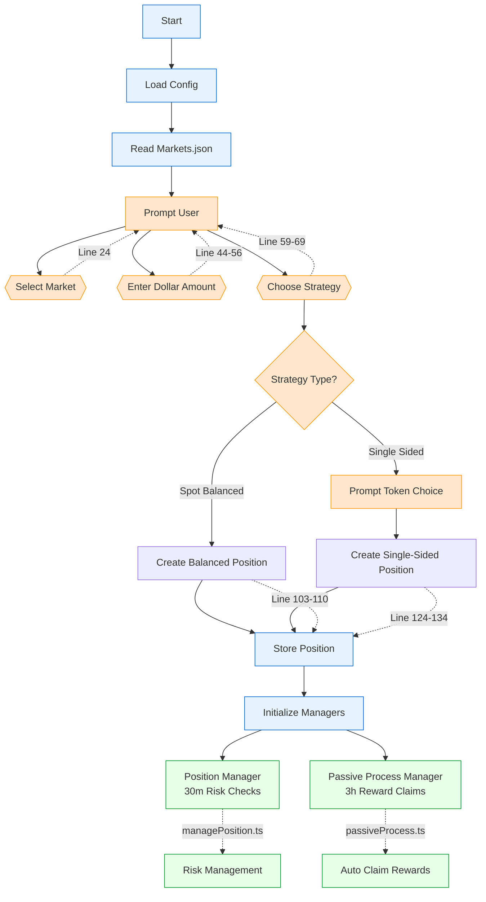

%% Mermaid diagram for index.ts application flow
flowchart TD

```mermaid
graph TD;
    A[Start] --> B[Load Config]
    B --> C[Read Markets.json]
    C --> D[Prompt User]
    D --> E{{Select Market}}
    D --> F{{Enter Dollar Amount}}
    D --> G{{Choose Strategy}}
    
    G --> H{Strategy Type?}
    H -->|Spot Balanced| I[Create Balanced Position]
    H -->|Single Sided| J[Prompt Token Choice]
    J --> K[Create Single-Sided Position]
    
    I --> L[Store Position]
    K --> L
    L --> M[Initialize Managers]
    
    M --> N[Position Manager\n30m Risk Checks]
    M --> O[Passive Process Manager\n3h Reward Claims]
    
    E -.->|Line 24| D
    F -.->|Line 44-56| D
    G -.->|Line 59-69| D
    I -.->|Line 103-110| L
    K -.->|Line 124-134| L
    N -.->|managePosition.ts| P[Risk Management]
    O -.->|passiveProcess.ts| Q[Auto Claim Rewards]
    
    classDef process fill:#e6f3ff,stroke:#0066cc;
    classDef decision fill:#ffe6cc,stroke:#ff9900;
    classDef parallel fill:#e6ffe6,stroke:#009933;
    
    class A,B,C,L,M process;
    class D,E,F,G,H,J decision;
    class N,O,P,Q parallel;
    
    click B "src/index.ts#L20" "Config Loading"
    click C "src/index.ts#L24-26" "Market Data"
    click I "src/utils/DLMMClient.ts#L474-482" "Position Creation"
    click K "src/utils/DLMMClient.ts#L466-477" "Single Side Logic"
    click N "src/managePosition.ts#L15-23" "Risk Management"
    click O "src/passiveProcess.ts#L25-50" "Reward System"
```