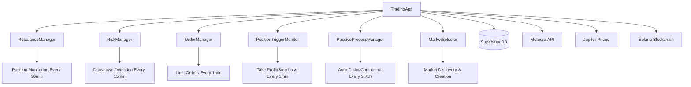

# Meteora DLMM Liquidity Bot 🤖

An advanced automated liquidity management bot for Meteora's Dynamic Liquidity Market Maker (DLMM) pools on Solana. This bot provides sophisticated position management, automated rebalancing, risk management, and order execution capabilities.

## 🎯 What This Bot Does

### Core Features
- **🔄 Automated Rebalancing**: Monitors positions across all pools and rebalances when price moves outside configured ranges
- **⚡ Risk Management**: Drawdown protection with circuit breakers and emergency position closure
- **📈 Order Management**: Limit orders, take profit, and stop loss execution
- **💰 Auto-Compounding**: Automatic fee claiming and re-investment
- **📊 Multi-Pool Support**: Manages unlimited positions across different DLMM pools
- **🎛️ REST API**: Complete API for external monitoring and control
- **📱 Real-time Dashboard**: Live position tracking with P&L calculations

### Advanced Capabilities
- Jupiter price integration for accurate USD valuations
- Meteora API integration for market discovery and fee tracking  
- Sophisticated position value tracking with historical performance
- Automated token swapping for optimal position creation
- Comprehensive error handling and transaction retry logic
- Rate-limited API endpoints with CORS support


### Known Dependencies Vulnerability
The bot has a known vulnerability in the `bigint-buffer` dependency ([CVE-2025-3194](https://github.com/advisories/GHSA-3gc7-fjrx-p6mg)) with **CVSS 7.7/10**, but this is **acceptable for internal use** because:
- **Low exploit probability**: 0.059% chance in next 30 days
- **Limited impact**: Application restart only, no data compromise  
- **Internal use only**: No external attack surface
- **Essential dependency**: Required for Solana SDK functionality

## 🚀 Quick Start

### Prerequisites
- Node.js 16+
- Supabase account and database
- Solana wallet with SOL for transactions
- RPC endpoint (preferably dedicated)

### 1. Installation
```bash
git clone https://github.com/brinkgenesis/dlmm.git
cd dlmm
npm install --legacy-peer-deps
```

### 2. Environment Setup
```bash
# Copy environment template
cp .env.example .env

# Edit with your configuration
nano .env
```

**Essential Environment Variables:**
```bash
# Solana Connection (REQUIRED)
SOLANA_RPC=https://api.mainnet-beta.solana.com
SOLANA_WSS=wss://api.mainnet-beta.solana.com/
PRIVATE_KEY=your_wallet_private_key_base58

# Database (REQUIRED)  
SUPABASE_URL=your_supabase_project_url
SUPABASE_SERVICE_KEY=your_supabase_service_key

# Price Feeds (REQUIRED)
SOL_Price_ID=0xef0d5b6f4312f347d4789b7093e2b2587ccd7a6369d8493a21ab88d6a0a1ffb5

# Bot Configuration (REQUIRED)
TOTAL_X_AMOUNT=10000
DATA_DIRECTORY=./data
METEORA_API_BASE_URL=https://dlmm-api.meteora.ag
ALLOWED_SLIPPAGE_BPS=50
LIQUIDITY_REMOVAL_UPPER_PERCENT=75
LIQUIDITY_REMOVAL_LOWER_PERCENT=25
VOLATILITY_CHECK_INTERVAL=60000
PRICE_FEED_URL=https://api.exchange.com/current-price
DEFAULT_MAX_HISTORY_LENGTH=100
TOTAL_RANGE_INTERVAL=10
BPS_TO_REMOVE=10000
```

### 3. Database Setup

Create these tables in your Supabase database:

<details>
<summary>📊 Database Schema (Click to expand)</summary>

```sql
-- Markets table for pool data
CREATE TABLE markets (
  id SERIAL PRIMARY KEY,
  name TEXT NOT NULL,
  public_key TEXT UNIQUE NOT NULL,
  address TEXT,
  mint_x TEXT,
  mint_y TEXT,
  token_x_mint TEXT,
  token_y_mint TEXT,
  token_x_symbol TEXT,
  token_y_symbol TEXT,
  token_x_logo TEXT,
  token_y_logo TEXT,
  token_x_created_at TIMESTAMP,
  token_y_created_at TIMESTAMP,
  tokens_old_enough BOOLEAN DEFAULT false,
  bin_step INTEGER,
  base_fee_percentage TEXT,
  max_fee_percentage TEXT,
  protocol_fee_percentage TEXT,
  liquidity TEXT,
  fees_24h NUMERIC,
  today_fees NUMERIC,
  trade_volume_24h NUMERIC,
  cumulative_trade_volume TEXT,
  cumulative_fee_volume TEXT,
  current_price NUMERIC,
  apr NUMERIC,
  apy NUMERIC,
  is_blacklisted BOOLEAN DEFAULT false,
  fee_volume_ratios JSONB,
  fees_by_timeframe JSONB,
  volume_by_timeframe JSONB,
  tags TEXT[],
  reserve_x TEXT,
  reserve_y TEXT,
  reserve_x_amount NUMERIC,
  reserve_y_amount NUMERIC,
  base_fee TEXT,
  daily_apr NUMERIC,
  tvl NUMERIC,
  volume_tvl_ratio NUMERIC,
  risk TEXT,
  last_updated TIMESTAMP DEFAULT NOW(),
  created_at TIMESTAMP DEFAULT NOW()
);

-- Positions table for tracking user positions
CREATE TABLE positions (
  id SERIAL PRIMARY KEY,
  user_id TEXT NOT NULL,
  pool_address TEXT NOT NULL,
  position_key TEXT UNIQUE NOT NULL,
  token_x_mint TEXT,
  token_y_mint TEXT,
  token_x_symbol TEXT,
  token_y_symbol TEXT,
  token_x_logo TEXT,
  token_y_logo TEXT,
  original_active_bin INTEGER,
  min_bin_id INTEGER,
  max_bin_id INTEGER,
  snapshot_position_value NUMERIC,
  current_price NUMERIC,
  current_price_usd NUMERIC,
  pending_fee_x TEXT DEFAULT '0',
  pending_fee_y TEXT DEFAULT '0',
  pending_fees_usd NUMERIC DEFAULT 0,
  total_claimed_fee_x TEXT DEFAULT '0',
  total_claimed_fee_y TEXT DEFAULT '0',
  total_fee_usd_claimed NUMERIC DEFAULT 0,
  daily_apr NUMERIC,
  starting_position_value NUMERIC,
  current_value NUMERIC,
  original_start_date TIMESTAMP,
  rebalance_count INTEGER DEFAULT 0,
  previous_position_key TEXT,
  fee_history JSONB,
  take_profit_price NUMERIC,
  stop_loss_price NUMERIC,
  created_at TIMESTAMP DEFAULT NOW(),
  updated_at TIMESTAMP DEFAULT NOW()
);

-- Orders table for limit/TP/SL orders
CREATE TABLE orders (
  id SERIAL PRIMARY KEY,
  user_id TEXT NOT NULL,
  pool_address TEXT NOT NULL,
  order_type TEXT NOT NULL CHECK (order_type IN ('LIMIT', 'TAKE_PROFIT', 'STOP_LOSS')),
  trigger_price NUMERIC NOT NULL,
  size_usd NUMERIC,
  close_bps INTEGER,
  side TEXT CHECK (side IN ('X', 'Y')),
  position_key TEXT,
  status TEXT DEFAULT 'PENDING' CHECK (status IN ('PENDING', 'EXECUTED', 'CANCELLED')),
  error_reason TEXT,
  executed_at TIMESTAMP,
  created_at TIMESTAMP DEFAULT NOW(),
  updated_at TIMESTAMP DEFAULT NOW()
);

-- Users table for delegation features
CREATE TABLE users (
  id SERIAL PRIMARY KEY,
  wallet_address TEXT UNIQUE NOT NULL,
  last_login TIMESTAMP,
  created_at TIMESTAMP DEFAULT NOW()
);
```
</details>

### 4. Validation & Startup
```bash
# Validate configuration
npm run validate

# Start the bot
npm start
```

## 🎮 Run Modes

```bash
npm start              # Full server with REST API (port 3001)
npm run start:cli      # Interactive CLI mode
npm run start:dashboard # View positions dashboard only  
npm run start:rebalance # Manual rebalance check
npm run validate       # Test configuration only
npm run dev            # Development mode with auto-reload
```

## 📡 REST API Endpoints

Once running on port 3001:

### Position Management
- `GET /api/positions` - Get all positions with detailed metrics
- `GET /api/positions/summary` - Get position summary statistics
- `POST /api/positions/close` - Close specific position
- `POST /api/positions/triggers` - Set take profit/stop loss

### Market Operations  
- `GET /api/markets` - Browse available markets with filtering
- `GET /api/markets/filtered` - Advanced market filtering
- `GET /api/markets/refresh` - Refresh market data from Meteora
- `POST /api/markets/select` - Create position in selected market

### Order Management
- `POST /api/orders` - Submit limit/TP/SL orders

### Bot Control
- `POST /api/config` - Update auto-claim/auto-compound settings
- `GET /api/rebalance/check` - Trigger manual rebalance check
- `POST /api/emergency/close-all-positions` - Emergency close all positions

### Wallet & Delegation
- `POST /api/wallet/connect` - Wallet authentication 
- `POST /api/wallet/verify` - Verify wallet signature
- `POST /api/wallet/delegate` - Set up delegation (if using)

## 📊 Bot Architecture



### Automated Processes
1. **Rebalance Manager** (30min intervals): Detects range breaches and creates new positions
2. **Risk Manager** (15min intervals): Monitors drawdowns and applies circuit breakers  
3. **Position Trigger Monitor** (5min intervals): Executes take profit and stop loss orders
4. **Passive Process Manager**: Auto-claims fees (3h) and compounds rewards (1h)
5. **Order Manager** (1min intervals): Processes limit orders when price conditions are met

## 🛠️ Configuration

The bot loads configuration from multiple sources:
1. **Environment Variables** (`.env` file) - Core settings and secrets
2. **Runtime Config** (`config.json`) - Auto-claim/compound preferences  
3. **Market Data** (Supabase) - Available pools and market information
4. **Position Data** (Supabase) - Historical position tracking

### Risk Management Settings

```typescript
// Configurable risk parameters in .env
LIQUIDITY_REMOVAL_UPPER_PERCENT=75  // Exit when price moves 75% above entry
LIQUIDITY_REMOVAL_LOWER_PERCENT=25   // Exit when price moves 75% below entry
ALLOWED_SLIPPAGE_BPS=50             // 0.5% slippage tolerance
BPS_TO_REMOVE=10000                 // Default to 100% removal on triggers
```

## 📈 Trading Strategies

### 1. Single-Sided Positions (BidAskImBalanced)
- **Range**: Dynamic based on active bin ±69 bins
- **Usage**: Directional trades or when you hold specific tokens
- **Rebalancing**: Automatic when price exits range

### 2. Spot Balanced Positions  
- **Range**: Configurable around current price
- **Usage**: Market making and balanced exposure
- **Rebalancing**: Maintains position within range

### 3. Order Types
- **Limit Orders**: Create positions when price hits target
- **Take Profit**: Close positions when profit target reached
- **Stop Loss**: Close positions when loss limit exceeded

## 📱 Example Usage

### Create a Position via API
```javascript
// Create position in selected market
const response = await fetch('http://localhost:3001/api/markets/select', {
  method: 'POST',
  headers: { 'Content-Type': 'application/json' },
  body: JSON.stringify({
    poolAddress: '3uGXqM4oZpztfxJqAL7k34ew6eFiBqQ9SzUCj3GuuiMG',
    singleSidedX: true,           // Use Token X  
    dollarAmount: 100,            // $100 position
    takeProfitPrice: 0.025,       // Take profit at $0.025
    stopLossPrice: 0.015          // Stop loss at $0.015
  })
});
```

### Set Position Triggers
```javascript
// Set take profit and stop loss for existing position
await fetch('http://localhost:3001/api/positions/triggers', {
  method: 'POST',
  headers: { 'Content-Type': 'application/json' },
  body: JSON.stringify({
    positionKey: 'your_position_key',
    takeProfitPrice: 0.025,       // TP at $0.025
    stopLossPrice: 0.015          // SL at $0.015
  })
});
```

### Emergency Close All Positions
```javascript
await fetch('http://localhost:3001/api/emergency/close-all-positions', {
  method: 'POST'
});
```

## 🔧 Available Markets

The bot includes several pre-configured high-volume markets:

| Market | Pool Address | Risk Level |
|--------|--------------|------------|
| GOAT_FART_100 | 3uGXqM4oZpztfxJqAL7k34ew6eFiBqQ9SzUCj3GuuiMG | High |
| CHILLGUY_SOL_125 | DhJNSHwyQ577dKevaXBq6EAJrVcBvV7TbY1G9QNh7bJg | Medium |
| FART_SOL_100 | CuhfMFrxwvtBXutitksd729hNjLhdzcdyzFj7RFYt6VT | High |
| FWOG_SOL_100 | 5eDWEqd9LuedRwXCaVkghFjyRTT2aMeEr667y65bzmEu | High |
| BULLY_SOL_200 | 3CkgBegtve9RRALeNqYLv9BZMWYuBVJNptQPA277V4CE | Medium |
| ZEREBRO_SOL_100 | 2FDHGS4gs1VYnp73bMfkb7zDAkHCS3h3DbP1WQAGVnsv | High |

Additional markets are discovered automatically via Meteora API integration.

## 🎛️ Monitoring & Controls

### Real-time Monitoring Files
- `last_rebalance_check.txt` - Last rebalance check timestamp
- `last_trigger_check.txt` - Last trigger check timestamp

### Dashboard Access
```bash
# View current positions
npm run start:dashboard

# Or via API
curl http://localhost:3001/api/positions/summary
```

### Manual Controls
```bash
# Force rebalance check
curl http://localhost:3001/api/rebalance/check

# Emergency stop
curl -X POST http://localhost:3001/api/emergency/close-all-positions
```

## ⚙️ Architecture Overview

### Core Components
- **`app.ts`**: Main TradingApp orchestrator
- **`rebalanceManager.ts`**: Position range monitoring and rebalancing
- **`riskManager.ts`**: Drawdown protection and circuit breakers
- **`positionTriggerMonitor.ts`**: Take profit and stop loss execution
- **`orderManager.ts`**: Limit order processing
- **`marketSelector.ts`**: Market discovery and position creation
- **`dashboard.ts`**: Position monitoring and analytics

### Data Management
- **`positionRepository.ts`**: Database position operations
- **`marketRepository.ts`**: Market data from Meteora API
- **`orderRepository.ts`**: Order tracking and execution
- **Position Storage**: Hybrid local cache + Supabase persistence

### Utilities
- **Price Feeds**: Jupiter API + Pyth oracles for accurate pricing
- **Transaction Handling**: Retry logic, priority fees, slippage protection
- **Token Management**: Automatic token swaps and balance optimization

## 🚨 Risk Management

### Automatic Protections
1. **Drawdown Circuit Breakers**: 15% drawdown triggers 50% position reduction
2. **Volume Drop Detection**: Exits positions when volume drops >50% below 6h average
3. **Range Breach Rebalancing**: Automatic position recreation when price exits range
4. **Transaction Safety**: Multiple retry attempts with increasing slippage tolerance

### Position Limits
- Configurable position sizing based on account balance
- Maximum slippage protection (default 0.5%)
- Minimum SOL balance warnings
- Automatic position cleanup for closed positions

## 🐛 Troubleshooting

### Common Issues

**1. "Module not found" errors**
```bash
npm install --legacy-peer-deps
```

**2. ".env file not found"**
```bash
cp .env.example .env
# Then edit .env with your values
```

**3. "Supabase connection failed"**
- Verify SUPABASE_URL and SUPABASE_SERVICE_KEY
- Ensure database tables are created
- Check Supabase project settings

**4. "Invalid private key"**
- Ensure PRIVATE_KEY is in base58 format (not array)
- Test with: `node -e "console.log(require('bs58').decode('YOUR_KEY'))"`

**5. "RPC connection timeout"**
- Try different RPC endpoints
- Consider using a dedicated RPC service

**6. "Insufficient SOL balance"**
- Ensure wallet has >0.1 SOL for transaction fees
- Monitor balance regularly

### Debug Commands
```bash
# Test individual components
npm run test:rebalance      # Test rebalance logic
npm run test:risk          # Test risk management
npm run validate           # Validate full setup

# Check specific functionality  
node -e "require('./dist/Tests/testCreateSingleSidePosition.js')"
node -e "require('./dist/src/utils/GetAllUserPositions.js')"
```

## 🔄 Development

### Project Structure
```
src/
├── app.ts                 # Main TradingApp class
├── models/               # Data models and configuration
├── services/             # Database and external API services
├── utils/                # Utility functions and helpers
├── dashboard.ts          # Position monitoring and analytics
├── rebalanceManager.ts   # Automated rebalancing logic
├── riskManager.ts        # Risk management and circuit breakers
└── startup.ts           # Validation and setup utilities
```

### Key Features by File
- **Position Management**: `positionRepository.ts`, `PositionStorage.ts`
- **Order Execution**: `orderManager.ts`, `positionTriggerMonitor.ts`  
- **Price Integration**: `fetchPriceJupiter.ts`, `fetch_price.ts`
- **Transaction Handling**: `closePosition.ts`, `swapTokens.ts`, `createSingleSidePosition.ts`
- **Market Discovery**: `marketRepository.ts`, `selectionIndexer.ts`

### Build & Deploy
```bash
npm run build                # Compile TypeScript
npm run build:start         # Build and start production
```

## 📝 Environment Variables Reference

<details>
<summary>🔧 Complete Environment Variables List (Click to expand)</summary>

### Required Variables
```bash
# Solana Connection
SOLANA_RPC=https://api.mainnet-beta.solana.com
SOLANA_WSS=wss://api.mainnet-beta.solana.com/
PRIVATE_KEY=your_base58_private_key

# Database  
SUPABASE_URL=your_supabase_project_url
SUPABASE_SERVICE_KEY=your_supabase_service_key

# Price Feeds
SOL_Price_ID=0xef0d5b6f4312f347d4789b7093e2b2587ccd7a6369d8493a21ab88d6a0a1ffb5

# Bot Configuration
TOTAL_X_AMOUNT=10000
DATA_DIRECTORY=./data
METEORA_API_BASE_URL=https://dlmm-api.meteora.ag
VOLATILITY_CHECK_INTERVAL=60000
PRICE_FEED_URL=https://api.exchange.com/current-price
DEFAULT_MAX_HISTORY_LENGTH=100
ALLOWED_SLIPPAGE_BPS=50
TOTAL_RANGE_INTERVAL=10
BPS_TO_REMOVE=10000
LIQUIDITY_REMOVAL_UPPER_PERCENT=75
LIQUIDITY_REMOVAL_LOWER_PERCENT=25
```

### Optional Variables
```bash
# Server
PORT=3001
NODE_ENV=production

# Delegation (for multi-user)
SERVER_SIGNING_KEY=your_server_signing_key
DELEGATION_PROGRAM_ID=your_delegation_program_id  
JWT_SECRET=your_jwt_secret

# Email Notifications
EMAIL_USERNAME=your_email
EMAIL_PASSWORD=your_password
METEORA_API_KEY=your_meteora_key
```
</details>

## 🎯 Performance & Capabilities

### Monitoring Intervals
- **Risk Management**: Every 15 minutes
- **Rebalancing**: Every 30 minutes  
- **Position Triggers**: Every 5 minutes
- **Order Processing**: Every 1 minute
- **Auto-Claiming**: Every 3 hours
- **Auto-Compounding**: Every 1 hour

### Supported Operations
- Unlimited positions across multiple pools
- Single-sided and balanced position strategies
- Automatic token swapping for optimal deposits
- Real-time P&L tracking with USD valuations
- Historical performance metrics
- Comprehensive fee tracking (pending + claimed)

### Technical Specifications
- **Languages**: TypeScript/Node.js
- **Blockchain**: Solana mainnet
- **Database**: Supabase (PostgreSQL)  
- **Price Feeds**: Jupiter API + Pyth Network
- **DLMM Protocol**: Meteora v1.3.0+

## ⚠️ Important Notes

### Security Considerations
- **Private Keys**: Keep your `.env` file secure and never commit it
- **Wallet Safety**: Consider using a dedicated trading wallet
- **RPC Security**: Use dedicated RPC endpoints for better reliability
- **Database Security**: Enable row-level security in Supabase if using delegation

### Financial Risks
- **Impermanent Loss**: Inherent risk in liquidity provision
- **Smart Contract Risk**: Meteora protocol dependency
- **Price Risk**: Sudden price movements can cause losses
- **Gas Costs**: Transaction fees reduce profitability

### Operational Considerations  
- Monitor your wallet balance regularly
- Check bot status via monitoring files
- Use emergency stop in volatile conditions
- Keep Supabase and RPC services funded/active

## 📞 Support & Contributing

### Logs and Debugging
- Bot creates detailed console logs
- Error tracking in Supabase database
- Position history preserved across rebalances
- Transaction signatures logged for troubleshooting

### Testing Components
```bash
# Test specific functionality
npm run test:rebalance     # Test rebalancing logic
npm run test:risk         # Test risk management
npm run test             # Run full test suite
```

This bot represents a production-ready automated liquidity management system with sophisticated risk controls, multi-pool support, and comprehensive monitoring capabilities. Start with small amounts and monitor carefully before scaling up your positions.