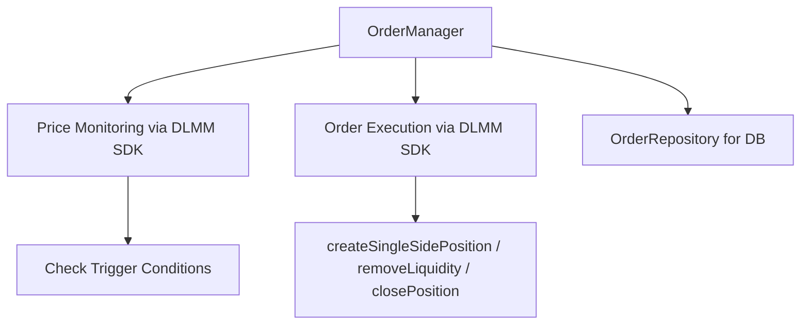
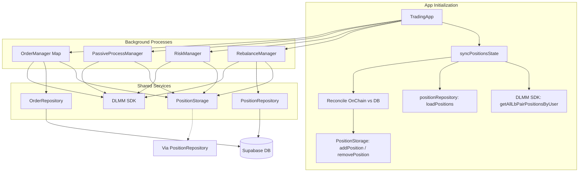

# Meteora DLMM Liquidity Provision Strategy Framework

## 1. Token Selection Protocol
### 1.1 Rug Detection System
- **Automated Checks**:
  - **Token Age Check**: Verifies token age via Jupiter/Birdeye metadata (`selectionIndexer.ts`, `marketRepository.ts` using `tokens_old_enough`).
  - *Missing*: Deployer wallet activity monitoring.
  - *Missing*: LP token lock verification.
  - *Missing*: Mint authority revocation checks.
- **Blockchain Forensics** (*Not Implemented*):
  - *Missing*: Bubblemaps.io holder distribution analysis.
  - *Missing*: Rugcheck.xyz contract audit integration.
  - *Missing*: Dexscreener whale wallet tracking.

**Implementation Status**: 🛠 Partial Implementation
- `selectionIndexer.ts` fetches token creation dates.
- `marketRepository.ts` filters markets based on `tokens_old_enough` flag during sync.
- **TODO**: Create `blockchain_analyzer.ts` for on-chain forensics (**Priority: High**)

### 1.2 Token Vetting Matrix
*(Note: Current implementation uses simpler filtering via MarketRepository and basic data, not a weighted confidence score)*
| Metric                  | Threshold / Data Source                                | Status | Code Reference       |
|-------------------------|--------------------------------------------------------|--------|----------------------|
| Token Age               | > Min Threshold (via `tokens_old_enough`)              | ✅      | `marketRepository.ts` |
| Liquidity (TVL)         | >$10,000 (via Meteora API)                             | ✅      | `marketRepository.ts` |
| Market Cap              | *Not directly filtered*                                | ❌      |                      |
| Volume/MCap Ratio (24h)| *Not directly filtered*                                | ❌      |                      |
| Volume (24h)            | Filterable via API (`marketRepository.ts`)             | ✅      | `marketRepository.ts` |
| APR                     | Filterable via API (`marketRepository.ts`)             | ✅      | `marketRepository.ts` |
| Holder Distribution     | *Not Implemented*                                      | ❌      |                      |
| Volatility Score        | *Not Implemented*                                      | ❌      |                      |

**Implementation Status**: 🛠 Partial Implementation
- `marketRepository.ts` fetches and filters markets from Meteora API based on Liquidity, APR, Volume.
- `selectionIndexer.ts` enriches market data with token metadata (age, symbols, logos).
- *Missing*: Implementation of a weighted `confidence_score.ts`.
- *Missing*: Integration of holder distribution or detailed volatility.
- **TODO**:
  - Enhance filtering in `marketRepository.ts` or create specific filtering logic if needed.
  - Implement `confidence_score.ts` if weighted scoring is desired.

**Minimum Confidence Score**: N/A (Currently uses direct filters)

---

## 2. Risk Management Architecture
### 2.1 Position Safety Protocols
- **Dynamic Sizing**: *Not Implemented* (Uses fixed/default amounts or balance percentage in `marketSelector.ts`).
- **Circuit Breakers**:
  - Drawdown detection (`riskManager.ts` checks `snapshotPositionValue` vs current value). Threshold not explicitly 15% in 30m, but logic exists.
  - Volume drop detection (`riskManager.ts` checks 6h avg volume drop). Threshold configurable.
  - Social sentiment trigger: *Not Implemented*.

**Implementation Status**: 🛠 Partial Implementation
- `riskManager.ts` implements drawdown detection (`enforceAllCircuitBreakers`) and position size adjustment (though currently generic reduction, not dynamic sizing based on score).
- Volume drop detection implemented (`checkVolumeDrop`).
- *Missing*: Dynamic sizing based on confidence score.
- *Missing*: Social sentiment integration.

### 2.2 Risk Management Implementation
- **Position Value Tracking**:
  - ✅ Uses Jupiter prices via `fetchPriceJupiter.ts`.
  - ✅ Handles SOL price oracle (`FetchPrice`).
  - ✅ Uses token decimals from DLMM SDK.
  - ✅ `startingPositionValue` stored in DB via `positionRepository.ts`.
- **Drawdown Detection**:
  - ✅ Monitors current value vs `snapshotPositionValue` (stored in DB).
  - ✅ `riskManager.ts` triggers adjustments.
- **Position Synchronization**:
  - ✅ `app.ts` (`syncPositionsState`) discovers on-chain positions via SDK.
  - ✅ `PositionStorage.ts`/`positionRepository.ts` handle DB sync and cleanup.
  - ✅ Active bin checked in `rebalanceManager.ts` and `dashboard.ts`.
- **Volume Monitoring**:
  - ✅ `riskManager.ts` calculates 6-hour MA and checks drop percentage.
  - ✅ Triggers position size adjustment.

**Implementation Status**: ✅ Completed (for implemented features)

### 2.3 Volatility Response System
- **Fee Adaptation**: *Not Implemented*.
- **Range Compression**: *Not Implemented*.

**Implementation Status**: ❌ Not Started
- **TODO**:
  - Create `volatility_analyzer.ts` to calculate volatility scores (**Priority: High**)
  - Implement fee adaptation logic.
  - Add volatility-based range adjustments in `marketSelector.ts` / `rebalanceManager.ts`.

---

## 3. Core Liquidity Strategies
### 3.1 Single-Sided (BidAskImBalanced)
*(Note: Assumes single-sided implies BidAskImbalanced for rebalancing/entry)*
**Parameters**:
- ✅ Range: Set dynamically around active bin in `createSingleSidePosition.ts` (69 bins wide).
- Bin density: *Implicitly set by DLMM pool's `binStep`*.
- Fee tier: *Uses pool's base fee, no dynamic adjustment*.

**Liquidity Distribution**: *Uses SDK default for BidAskImbalanced*.

**Exit Triggers**:
- ✅ Range Breach: Handled by `rebalanceManager.ts`.
- Price +X%: *Handled by `orderManager.ts` if TP order is set*.
- Consolidation cycles: *Not Implemented*.
- Time expiration: *Not Implemented*.

**Implementation Status**: ✅ Completed (for core creation/rebalancing)
- `createSingleSidePosition.ts` implements single-sided creation using `StrategyType.BidAskImBalanced`.
- `rebalanceManager.ts` closes and creates new single-sided positions on range breach.
- `orderManager.ts` exists for potential TP/SL orders.

### 3.2 Balanced Spot Strategy
*(Note: Current implementation focuses on single-sided; balanced Spot not explicitly used)*
**Market Making Profile**:
- Range: Configurable during manual creation? Rebalancing creates single-sided.
- Rebalance threshold: ✅ Handled by range breach in `rebalanceManager.ts`.

**Fee Optimization**:
- ✅ Auto-compound: Implemented in `autoCompounder.ts` / `passiveProcess.ts`. Interval likely configurable.
- Dynamic fee boost: *Not Implemented*.
- Transaction batching: ✅ Basic priority fees added, complex batching likely not. (`transactionHelpers.ts` might have utils).

**Implementation Status**: 🛠 Partial Implementation
- Core rebalancing creates single-sided. Balanced strategy needs explicit selection/implementation if desired.
- Auto-compounding exists.

---

## 4. Advanced Strategic Modules
### 4.1 Liquidity Cycling System
**Market Phase Detection**: *Not Implemented*.
- Accumulation (BB Width): *Not Implemented*.
- Distribution (BB Width): *Not Implemented*.
- Exit Protocol (RSI): *Not Implemented*.

**Implementation Status**: ❌ Not Started
- `rebalanceManager.ts` handles basic range-breach rebalancing only.
- **TODO**: Implement market phase detection (Bollinger Bands, RSI) and strategy switching logic.

### 4.2 Social Sentiment Engine
**CT (Crypto Twitter) Integration**: *Not Implemented*.
**Telegram Signal Processing**: *Not Implemented*.

**Implementation Status**: ❌ Not Started
- **TODO**: Create `social_sentiment.ts` for social data analysis (**Priority: High**)

---

## 5. Monitoring & Reporting Framework
### 5.1 Key Performance Metrics
| Metric                  | Status | Details                                         | Code Reference |
|-------------------------|--------|-------------------------------------------------|----------------|
| Fee APY (Calculated)    | ✅      | `dailyAPR` fetched from Meteora/DB in dashboard | `dashboard.ts` |
| Impermanent Loss Ratio  | ❌      | Not Calculated                                  |                |
| Position Utilization     | ❌      | Not Calculated                                  |                |
| Volatility Exposure      | ❌      | Not Calculated                                  |                |
| Position PnL            | ✅      | Calculated in dashboard using `startingPositionValue` | `dashboard.ts` |

**Implementation Status**: 🛠 Partial Implementation
- `dashboard.ts` implements position monitoring, fetching data from DB, chain, and APIs. Calculates basic PnL.
- `positionRepository.ts` stores `startingPositionValue`.
- *Missing*: IL calculation, Utilization, Volatility metrics.
- **TODO**: Implement calculation and display of missing KPIs in `dashboard.ts`.

### 5.2 Alert Hierarchy
**Level 1 (Telegram)**: *Not Implemented*.
**Level 2 (Email+SMS)**: *Not Implemented*.
**Level 3 (System Shutdown)**: *Not Implemented*.

**Implementation Status**: ❌ Not Started
- **TODO**: Create `alerting_system.ts` to handle alerts (**Priority: High**)

---

## 6. Order Management Architecture
### 6.1 System Overview

**Implementation Status**: ✅ Completed (Structure exists)

### 6.2 Core Components
**Order Configuration**: ✅ Defined in `orderManager.ts` and `orderRepository.ts`.
**Execution Flow**: ✅ Basic structure in `orderManager.ts`, relies on interval checks (likely within `passiveProcess.ts` or similar loop). Needs verification of polling interval/mechanism. `orderRepository.ts` handles DB storage.

**Implementation Status**: ✅ Completed (Structure exists)

### 6.3 Order Types Matrix
| Type          | Status | Details                                       | Code Reference   |
|---------------|--------|-----------------------------------------------|------------------|
| LIMIT         | ✅      | Calls `createSingleSidePosition` (via wrapper) | `orderManager.ts` |
| TAKE_PROFIT   | ✅      | Calls `removeLiquidity`                       | `orderManager.ts` |
| STOP_LOSS     | ✅      | Calls `removeLiquidity`                       | `orderManager.ts` |

**Implementation Status**: ✅ Completed

---

## 7. Multi-Pool Management
### 7.1 Architecture Principles

**Implementation Status**: ✅ Completed
- Architecture implemented across `app.ts`, manager classes, storage, and repositories.

### 7.2 Key Enhancements
**Unified Position Handling**: ✅ `app.ts` uses `DLMM.getAllLbPairPositionsByUser` and syncs with `PositionStorage`/`PositionRepository`.
**Cross-Pool Initialization**: ✅ `app.ts` handles initialization and managers operate across all known positions. `rebalanceManager` processes pool-by-pool.

**Implementation Status**: ✅ Completed

---

## 8. Implementation Checklist
| Component              | Status | Details                                  | Code Reference         |
|------------------------|--------|------------------------------------------|------------------------|
| Order Manager          | ✅      | Structure for Limit/TP/SL                | `orderManager.ts`       |
| Multi-Pool Processes   | ✅      | Position discovery and processing        | `app.ts`, Managers      |
| Global Fee Tracking    | 🛠      | Basic `dailyAPR`, `totalClaimed` in dash | `dashboard.ts`        |
| Batch Order Execution  | ❌      | Likely executes orders individually     | `orderManager.ts`       |
| PnL Tracking           | ✅      | Uses `startingPositionValue`            | `dashboard.ts`, `positionRepository.ts` |
| Market Selection API   | ✅      | Market fetching and position creation    | `server.ts`, `marketSelector.ts` |
| Volatility Response    | ❌      | Not implemented                         | N/A                   |
| Delegation System      | 🛠      | Backend/API structure, on-chain likely incomplete | `server.ts`       |
| Social Sentiment       | ❌      | Not implemented                         | N/A                   |
| Alerting System        | ❌      | Not implemented                         | N/A                   |
| Rug Detection (Basic)  | 🛠      | Token age check implemented             | `selectionIndexer.ts` |

---

## 9. Monitoring Framework
### 9.1 Key Metrics
| Metric                  | Status | Details                                 |
|-------------------------|--------|-----------------------------------------|
| Active Orders           | ❌      | Need endpoint/logic to query `OrderRepository` |
| Order Execution Latency | ❌      | Requires tracking execution time        |
| Cross-Pool Exposure     | 🛠      | Dashboard shows total value, easy to calc % |
| Position PnL            | ✅      | Calculated in dashboard                 |

**Implementation Status**: 🛠 Partial Implementation
- `dashboard.ts` provides basic metrics.
- **TODO**: Implement specific monitoring metrics and alerts.

### 9.2 Alert Hierarchy Update
**Level 2 (Enhanced)**: *Not Implemented*.

**Implementation Status**: ❌ Not Started
- **TODO**: Create alerting system.

---

## 10. Strategic Roadmap
### Phase 5: Market Selection System (Completed)
| Priority | Task                          | Owner            | Status  |
|----------|-------------------------------|------------------|---------|
| P0       | Market Discovery API          | Core Team        | ✅      |
| P1       | Risk Rating Implementation    | Risk Team        | 🛠 (Basic filtering, not rating) |
| P2       | Market Integration            | Integration Team | ✅      |

### Phase 6: Position Performance Tracking (Completed)
| Priority | Task                           | Owner            | Status  |
|----------|--------------------------------|------------------|---------|
| P0       | Initial Position Value Storage | Core Team        | ✅      |
| P1       | PnL Calculations               | Analysis Team    | ✅      |
| P2       | Dashboard Integration          | Frontend Team    | ✅ (Backend API) |

### Phase 7: Volatility Response System (Not Started)
| Priority | Task                          | Owner            | Status  |
|----------|-------------------------------|------------------|---------|
| P0       | Volatility Scoring            | Data Science     | ❌      |
| P1       | Fee Adaptation                | Core Team        | ❌      |
| P2       | Range Compression             | Core Team        | ❌      |

### Phase 8: Frontend Integration & Delegation (In Progress)
| Priority | Task                          | Owner            | Status  |
|----------|-------------------------------|------------------|---------|
| P0       | Wallet Connection             | Frontend / Backend | 🛠 (Backend API exists) |
| P1       | Delegation Implementation     | Core Team / Solana | 🛠 (Backend API exists, On-chain?) |
| P2       | Dashboard UI                  | Design / Frontend | ⏳ (Backend API exists) |

---

## 11. New Features
### 11.1 Market Selection System
- **Market Discovery**: ✅ Implemented via `marketRepository.ts` and `/api/markets` endpoint. Basic filtering exists.
- **Position Creation**: ✅ Implemented via `marketSelector.ts` and `/api/markets/select`. Handles swaps.

**Implementation Status**: ✅ Completed

### 11.2 Jupiter Price Integration
- **Price Feed System**: ✅ Implemented in `utils/fetchPriceJupiter.ts`. Used in dashboard, creation, rebalancing.

**Implementation Status**: ✅ Completed

### 11.3 Position Performance Tracking
- **Initial Value Recording**: ✅ Implemented via `createSingleSidePosition` saving `startingValue` to DB via `positionRepository`.
- **P&L**: ✅ Calculated in `dashboard.ts`.

**Implementation Status**: ✅ Completed

### 11.4 REST API Interface
- **/api/markets**: ✅ Implemented.
- **/api/markets/filtered**: ✅ Implemented.
- **/api/markets/refresh**: ✅ Implemented.
- **/api/markets/select**: ✅ Implemented.
- **/api/positions**: ✅ Implemented.
- **/api/positions/summary**: ✅ Implemented.
- **/api/rebalance/check**: ✅ Implemented.
- **/api/config**: ✅ Implemented.
- **/api/emergency/close-all-positions**: ✅ Implemented.
- **/api/wallet/***: ✅ Basic structure implemented for connect/verify/delegate.

**Implementation Status**: ✅ Completed (for listed endpoints)

### 11.5 Delegation System
- **User Authentication**: ✅ Basic connect/verify API endpoints exist. JWT generation implemented.
- **Delegation Authority**: 🛠 API endpoint exists, but on-chain program status and full integration are unclear/likely incomplete.

**Implementation Status**: 🛠 Partial Implementation
- **TODO**: Complete Solana program integration & testing (**Priority: Medium**)

---

## 12. High Priority Implementation Tasks

*(Revised Priorities based on current state)*

1.  **Priority 1: Rug Detection & Alerts**
    *   Create `blockchain_analyzer.ts` for on-chain forensics (holder analysis, deployer activity).
    *   Create `social_sentiment.ts` for social media monitoring.
    *   Create `alerting_system.ts` for multi-channel alerts based on risk triggers, sentiment, PnL.

2.  **Priority 2: Volatility Response System**
    *   Create `volatility_analyzer.ts` (potentially using Volatility Accumulator data if available via API/SDK).
    *   Integrate score into `riskManager.ts` for dynamic fee/range adjustments.
    *   Adjust position creation logic (`marketSelector.ts`, `rebalanceManager.ts`) based on volatility.

3.  **Priority 3: Delegation System Completion**
    *   Complete/Verify Solana program for delegation.
    *   Enhance backend API (`server.ts`) for full delegation lifecycle (create, verify, manage, revoke).
    *   Integrate delegation signing into relevant SDK calls (`withSafeKeypair` needs modification or alternative).

4.  **Priority 4: Advanced Vetting & Strategy**
    *   Implement `confidence_score.ts` if weighted scoring is desired over simple filtering.
    *   Implement advanced market phase detection (BB, RSI) in `rebalanceManager.ts` or a new strategy module.
    *   Implement IL calculation/simulation.

---

## 13. Files That Can Be Removed
*(Based on strategy doc and likely current usage)*
- `DLMMClient.ts` - ✅ (Confirmed replaced by SDK)
- `fetchFilterMarkets.ts` - ✅ (Likely unused, replaced by `marketRepository.ts`)
- `runImpermanentLossAnalysis.ts` - ✅ (Test script)
- `pythUtils.ts` - ✅ (Confirmed unused, Jupiter used)
- `positionSnapshot.ts` - ❓ (Potentially replaced by DB storage via `positionRepository` and live data fetching in `dashboard`. Needs verification if any unique logic remains.) 