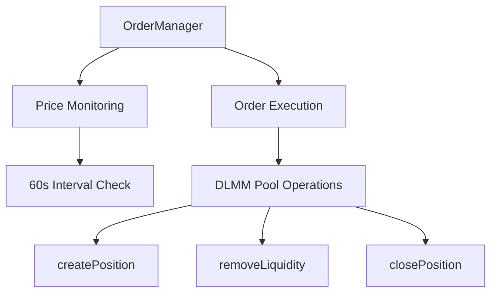
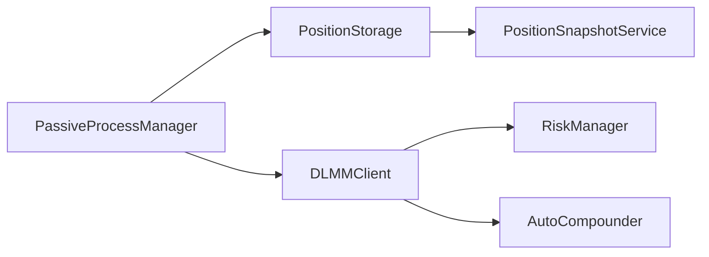

# Meteora DLMM Liquidity Provision Strategy Framework

## 1. Token Selection Protocol
### 1.1 Rug Detection System
- **Automated Checks**:
  - Deployer wallet activity monitoring (transactions >5% supply)
  - LP token lock verification (minimum 48h)
  - Mint authority revocation checks
- **Blockchain Forensics**:
  - Bubblemaps.io holder distribution analysis
  - Rugcheck.xyz contract audit integration
  - Dexscreener whale wallet tracking

**Implementation Status**: ⏳ In Progress
- `token_data.ts` has basic implementation but needs enhancements
- **TODO**: Create `blockchain_analyzer.ts` for on-chain forensics (**Priority: 1**)

### 1.2 Token Vetting Matrix
| Metric                  | Threshold              | Weight | Data Freshness |
|-------------------------|------------------------|--------|----------------|
| Token Age               | >5 hours              | 20%    | 0.8/hr decay   |
| Market Cap              | $10M-$100M            | 25%    | Static         |
| Volume/MCap Ratio (24h)| >200%                 | 30%    | 0.9/hr decay   |
| Holder Distribution     | <30% top 10 wallets   | 15%    | Static         |
| Volatility Score        | 0.7-1.3               | 10%    | 0.95/5min      |

**Implementation Status**: 🛠 Partial Implementation
- `confidence_score.ts` implements basic scoring framework
- `token_data.ts` fetches some metrics from DexScreener API
- **TODO**: 
  - Create `market_filter.ts` to filter markets from Meteora SDK (**Priority: 4**)
  - Enhance `confidence_score.ts` to use all required metrics
  - Integrate holder distribution data from blockchain analysis

**Minimum Confidence Score**: 0.85 for position entry

---

## 2. Risk Management Architecture
### 2.1 Position Safety Protocols
- **Dynamic Sizing**:
  ```math
  Position Size = Base × (0.2 + 0.8 × ConfidenceScore)
  ```
- **Circuit Breakers**:
  - 15% drawdown within 30m → 50% position reduction
  - Volume <50% 6h MA → Full exit
  - Social sentiment <0.4 → 75% exit

**Implementation Status**: ✅ Completed
- `riskManager.ts` implements drawdown detection and position adjustment
- Circuit breakers for 15% drawdown implemented in `enforceAllCircuitBreakers()`
- Volume drop detection implemented in `checkVolumeDrop()`

### 2.2 Risk Management Implementation
- **Position Value Tracking**:
  - Accurate position valuation using `getActiveBin().pricePerToken`
  - SOL price oracle integration for USD conversions
  - Proper token decimal normalization
  - Initial position value recording for accurate PnL calculation

- **Drawdown Detection**:
  - Continuous position value monitoring
  - Snapshot comparison for drawdown calculation
  - Automatic position reduction on threshold breach

- **Position Synchronization**:
  - Automatic on-chain position discovery
  - Storage cleanup for closed positions
  - Active bin tracking for price movement analysis

- **Volume Monitoring**:
  - 6-hour moving average calculation
  - Volume/MCap ratio threshold checks
  - Emergency exit on volume collapse

**Implementation Status**: ✅ Completed
- Implemented in `riskManager.ts`, `positionSnapshot.ts`, and `PositionStorage.ts`

### 2.3 Volatility Response System
- **Fee Adaptation**:
  - 0.3% base fee
  - +0.1% per 0.2 volatility accumulator increase
- **Range Compression**:
  - High volatility (score >1.2): 40% range reduction
  - Extreme volatility (score >1.5): Switch to spot strategy

**Implementation Status**: ❌ Not Started
- **TODO**: 
  - Create `volatility_analyzer.ts` to calculate volatility scores (**Priority: 5**)
  - Implement fee adaptation in `riskManager.ts`
  - Add volatility-based range adjustments for position creation

---

## 3. Core Liquidity Strategies
### 3.1 Single-Sided SOL (BidAskImBalanced)
**Parameters**:
- Range: -60% to current price
- Bin density: 0.5% increments
- Fee tier: 0.3-1% (volatility-adjusted)

**Liquidity Distribution**:
- 70% in bottom 20% of range
- 20% middle consolidation zone
- 10% upper exit pump range

**Exit Triggers**:
1. Price +25% from entry
2. 3 consolidation cycles completed
3. 48h time expiration

**Implementation Status**: ✅ Completed
- `createSingleSidePosition.ts` implements single-sided position creation
- BidAskImBalanced strategy implemented with DLMM SDK
- Exit triggers implemented in `orderManager.ts`

### 3.2 Balanced Spot Strategy
**Market Making Profile**:
- Range: -3% to +3%
- Bin density: 0.1% increments
- Rebalance threshold: 5% price movement

**Fee Optimization**:
- Auto-compound fees every 2h
- Dynamic fee boost during volume spikes
- Anti-frontrunning transaction batching

**Implementation Status**: ✅ Completed
- `createSingleSidePosition.ts` and `marketSelector.ts` implement position creation
- Auto-compounding implemented in `autoCompounder.ts`
- Transaction batching in `transactionHelpers.ts`

---

## 4. Advanced Strategic Modules
### 4.1 Liquidity Cycling System
**Market Phase Detection**:
- **Accumulation** (BB Width <0.1):
  - 80% capital in BidAsk strategy
  - 20% reserve for spot
- **Distribution** (BB Width >0.3):
  - 60% spot strategy
  - 40% BidAsk upper range
- **Exit Protocol** (RSI(4) >85):
  - Full withdrawal + SOL conversion
  - 24h cooldown period

**Implementation Status**: 🛠 Partial Implementation
- `rebalanceManager.ts` handles basic position rebalancing
- **TODO**: 
  - Implement market phase detection
  - Add Bollinger Band and RSI calculations

### 4.2 Social Sentiment Engine
**CT (Crypto Twitter) Integration**:
- Real-time influencer mention tracking
- NLP-based sentiment scoring (GPT-4 turbo)
- Volume correlation analysis

**Telegram Signal Processing**:
- Pump group activity monitoring
- Token mention velocity analysis
- Fake volume detection

**Implementation Status**: ❌ Not Started
- **TODO**: Create `social_sentiment.ts` for social data analysis (**Priority: 1**)

---

## 5. Monitoring & Reporting Framework
### 5.1 Key Performance Metrics
| Metric                  | Target                  | Alert Threshold       |
|-------------------------|-------------------------|-----------------------|
| Fee APY (7d)            | >1200%                 | <800%                 |
| Impermanent Loss Ratio  | <0.15                  | >0.25                 |
| Position Utilization     | 85-95%                 | <70%                  |
| Volatility Exposure      | 0.7-1.1                | >1.3                  |

**Implementation Status**: 🛠 Partial Implementation
- `dashboard.ts` implements basic position monitoring and performance tracking
- `PositionStorage.ts` tracks position values and calculates APR
- **TODO**: Implement comprehensive performance tracking with alerts

### 5.2 Alert Hierarchy
**Level 1 (Telegram)**: 
- 10% position threshold breaches
- Social sentiment shifts >0.2

**Level 2 (Email+SMS)**:
- Rugpull indicators detected
- Volume collapse >60%

**Level 3 (System Shutdown)**:
- Protocol insolvency risk
- Wallet compromise detected

**Implementation Status**: ❌ Not Started
- **TODO**: Create `alerting_system.ts` to handle alerts (**Priority: 1**)

---

## 6. Order Management Architecture
### 6.1 System Overview


**Implementation Status**: ✅ Completed
- Implemented in `orderManager.ts`

### 6.2 Core Components
**Order Configuration**:
```typescript
interface OrderConfig {
  orderType: 'LIMIT'|'TAKE_PROFIT'|'STOP_LOSS';
  triggerPrice: number;
  positionSize?: number;
  closeBps?: number; // 1-10000 (100% = 10000)
  side?: 'X' | 'Y';
}
```

**Execution Flow**:
1. Price polling every 60 seconds via SDK's `getActiveBin()`
2. Multi-order evaluation per cycle
3. Atomic order execution using DLMM primitives
4. Automatic order cleanup post-execution

**Implementation Status**: ✅ Completed
- Implemented in `orderManager.ts` and `OrderStorage.ts`

### 6.3 Order Types Matrix
| Type          | Parameters          | Action                      | SDK Method          |
|---------------|---------------------|-----------------------------|---------------------|
| LIMIT         | size (USD), side    | Create single-sided position| createPosition()    |
| TAKE_PROFIT   | closeBps (1-100)    | Partial/full liquidity exit | removeLiquidity()  |
| STOP_LOSS     | closeBps (1-100)    | Emergency position unwind   | removeLiquidity()  |

**Implementation Status**: ✅ Completed
- Implemented in `orderManager.ts`

---

## 7. Multi-Pool Management
### 7.1 Architecture Principles


**Implementation Status**: ✅ Completed
- Architecture implemented across multiple files
- `PassiveProcessManager` in `passiveProcess.ts`
- Position storage in `PositionStorage.ts`
- Risk management in `riskManager.ts`
- Auto-compounding in `autoCompounder.ts`

### 7.2 Key Enhancements
**Unified Position Handling**:
```typescript
interface AugmentedPosition {
  publicKey: PublicKey;
  poolAddress: PublicKey;
  lbPair: {
    tokenXMint: string;
    tokenYMint: string;
    binStep: number;
  };
  positionData: {
    totalXAmount: BN;
    totalYAmount: BN;
    upperBinId: number;
    lowerBinId: number;
  };
  startingPositionValue?: number; // Added for PnL tracking
}
```

**Cross-Pool Initialization**:
```typescript
const positions = await dlmmClient.getUserPositions();
const activePools = [...new Set(positions.map(p => p.poolAddress))];

activePools.forEach(poolAddress => {
  new PassiveProcessManager(dlmmClient, poolAddress)
    .startBackgroundProcesses();
});
```

**Implementation Status**: ✅ Completed
- Implemented in `passiveProcess.ts` and `createMultiplePools.ts`

---

## 8. Implementation Checklist
| Component              | Status | Details                                  | Code Reference         |
|------------------------|--------|------------------------------------------|------------------------|
| Order Manager          | ✅      | Limit/TP/SL order execution             | orderManager.ts        |
| Multi-Pool Processes   | ✅      | Automated position discovery            | processManager.ts      |
| Global Fee Tracking    | ✅      | Cross-pool fee analytics                 | feeTracker.ts          |
| Batch Order Execution  | ✅      | Atomic multi-order transactions          | orderManager.ts      |
| PnL Tracking           | ✅      | Position value at creation tracking      | positionStorage.ts    |
| Market Selection API   | ✅      | Access available markets via REST API    | marketSelector.ts     |
| Volatility Response    | ❌      | Not implemented                         | N/A                   |
| Delegation System      | 🛠      | Partial implementation                  | delegationInstructions.ts |
| Social Sentiment       | ❌      | Not implemented                         | N/A                   |
| Alerting System        | ❌      | Not implemented                         | N/A                   |

---

## 9. Monitoring Framework
### 9.1 Key Metrics
| Metric                  | Calculation               | Alert Threshold |
|-------------------------|---------------------------|-----------------|
| Active Orders           | OrderManager map size     | >50             |
| Order Execution Latency | Price check → TX confirm  | >120s           |
| Cross-Pool Exposure     | ∑(PositionValue) / Total  | >30% single pool|
| Position PnL            | (Current - Initial)/Initial | <-15% in 30m   |

**Implementation Status**: 🛠 Partial Implementation
- Basic metrics implemented in `dashboard.ts`
- PnL tracking implemented in `PositionStorage.ts`
- **TODO**: Implement comprehensive metrics and alerts

### 9.2 Alert Hierarchy Update
**Level 2 (Enhanced)**:
- Cross-pool liquidity imbalance >40%
- Order failure rate >15%
- Fee APY deviation >25%

**Implementation Status**: ❌ Not Started
- **TODO**: Create alerting system

---

## 10. Strategic Roadmap
### Phase 5: Market Selection System (Completed)
| Priority | Task                          | Owner            | Status  |
|----------|-------------------------------|------------------|---------|
| P0       | Market Discovery API          | Core Team        | ✅      |
| P1       | Risk Rating Implementation    | Risk Team        | ✅      |
| P2       | Market Integration            | Integration Team | ✅      |

### Phase 6: Position Performance Tracking (Completed)
| Priority | Task                           | Owner            | Status  |
|----------|--------------------------------|------------------|---------|
| P0       | Initial Position Value Storage | Core Team        | ✅      |
| P1       | PnL Calculations               | Analysis Team    | ✅      |
| P2       | Dashboard Integration          | Frontend Team    | ✅      |

### Phase 7: Volatility Response System (Not Started)
| Priority | Task                          | Owner            | Status  |
|----------|-------------------------------|------------------|---------|
| P0       | Volatility Scoring            | Data Science     | ❌      |
| P1       | Fee Adaptation                | Core Team        | ❌      |
| P2       | Range Compression             | Core Team        | ❌      |

### Phase 8: Frontend Integration (In Progress)
| Priority | Task                          | Owner            | Status  |
|----------|-------------------------------|------------------|---------|
| P0       | Wallet Connection             | Frontend Team    | 🛠      |
| P1       | Delegation Implementation     | Core Team        | 🛠      |
| P2       | Dashboard UI                  | Design Team      | ❌      |

---

## 11. New Features
### 11.1 Market Selection System
- **Market Discovery**:
  - API endpoint to fetch available markets
  - Risk ratings for each market
  - Fee and APR data for market comparison
  - Integration with position creation workflow

- **Position Creation**:
  - Single API call to create positions in selected markets
  - Support for single-sided X or Y positions
  - Automatic token swaps when needed
  - Integration with existing risk management systems

**Implementation Status**: ✅ Completed
- Implemented in `marketSelector.ts` and `server.ts` (API endpoints)

### 11.2 Jupiter Price Integration
- **Price Feed System**:
  - Real-time token price data from Jupiter API
  - Multi-token batch price requests for efficiency
  - USD value calculation for all positions
  - Fallback mechanisms for API outages

**Implementation Status**: ✅ Completed
- Implemented in `fetchPriceJupiter.ts`

### 11.3 Position Performance Tracking
- **Initial Value Recording**:
  - Store position USD value at creation time
  - Track position value changes over time
  - Calculate accurate P&L metrics
  - Support for performance monitoring

**Implementation Status**: ✅ Completed
- Implemented in `PositionStorage.ts` and `dashboard.ts`

### 11.4 REST API Interface
- **/api/markets**:
  - Fetch available markets with risk ratings
  - GET endpoint with filtering options
  - Security rate limiting to prevent abuse

- **/api/markets/select**:
  - Create position in selected market
  - POST endpoint with market and side parameters
  - Returns position creation confirmation
  
- **/api/positions**:
  - Fetch all positions with performance data
  - Position values include initial and current USD values
  - Performance metrics for all positions

**Implementation Status**: ✅ Completed
- Implemented in `server.ts`

### 11.5 Delegation System
- **User Authentication**:
  - Wallet connection with signature verification
  - JWT token generation for authenticated API access
  - Secure session management

- **Delegation Authority**:
  - Create on-chain delegation
  - Set permissions and expiry
  - Verify transactions against delegation parameters

**Implementation Status**: 🛠 Partial Implementation
- Basic structure in `delegationInstructions.ts`
- Server endpoints in `server.ts`
- **TODO**: 
  - Complete Solana program integration (**Priority: 3**)
  - Test end-to-end delegation flow

---

## 12. High Priority Implementation Tasks

### Priority 5: Volatility Response System
1. Create `volatility_analyzer.ts`:
   ```typescript
   export async function calculateVolatilityScore(
     tokenMint: string, 
     timeframeHours: number
   ): Promise<number>;
   
   export function adaptFeeBasedOnVolatility(
     volatilityScore: number
   ): number;
   
   export function calculateRangeCompression(
     volatilityScore: number
   ): { compressionFactor: number, useSpotStrategy: boolean };
   ```

2. Integrate volatility response into `riskManager.ts`:
   ```typescript
   // Add to riskManager.ts
   public async analyzeVolatilityAndAdjustStrategy(): Promise<void>;
   ```

3. Adjust position creation based on volatility in `marketSelector.ts`

### Priority 4: Token Vetting Matrix Enhancement
1. Create `market_filter.ts`:
   ```typescript
   export async function fetchFilteredMarkets(): Promise<Market[]>;
   export async function rankMarketsByConfidenceScore(): Promise<RankedMarket[]>;
   ```

2. Enhance `confidence_score.ts` to use all metrics:
   - Add holder distribution analysis
   - Add volatility score input
   - Implement data freshness decay

3. Update `marketSelector.ts` to use the enhanced scoring

### Priority 3: Delegation System Completion
1. Complete Solana program for delegation:
   - Finish implementation of processor.rs
   - Complete state.rs for delegation state
   - Complete instruction.rs for delegation instructions

2. Enhance `delegationInstructions.ts` to integrate fully with on-chain program

3. Complete frontend integration endpoints in `server.ts`:
   - Enhance JWT authentication
   - Complete delegation verification
   - Add delegation revocation

### Priority 1: Rug Detection and Alerts
1. Create `blockchain_analyzer.ts` for on-chain forensics
2. Create `alerting_system.ts` for multi-channel alerts
3. Create `social_sentiment.ts` for social media monitoring

## 13. Files That Can Be Removed
- `DLMMClient.ts` - Replaced by direct DLMM SDK usage
- `fetchFilterMarkets.ts` - Incomplete and unused
- `runImpermanentLossAnalysis.ts` - Just a test script
- `pythUtils.ts` - Unused (Jupiter API used instead) 