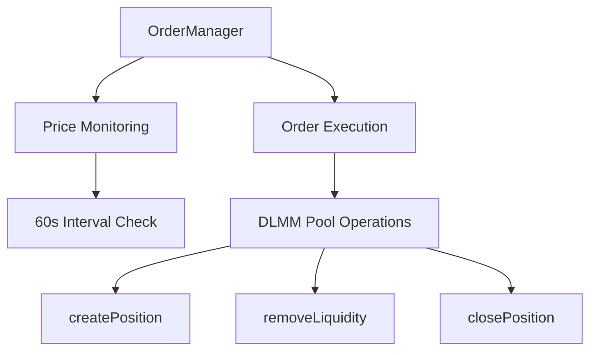
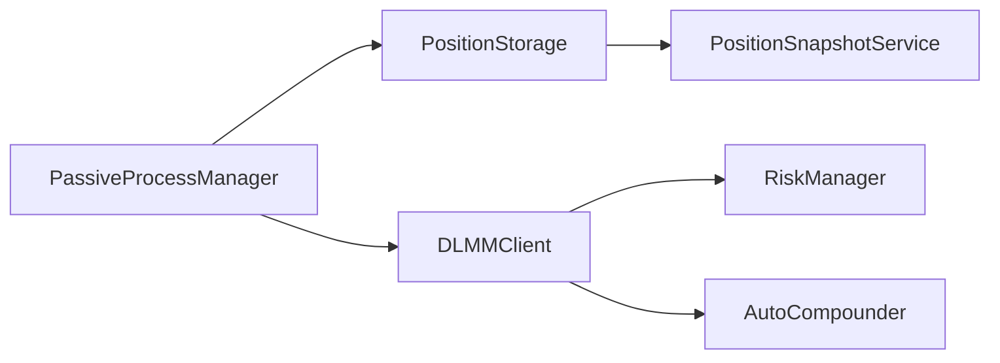

# Meteora DLMM Liquidity Provision Strategy Framework

## 1. Token Selection Protocol
### 1.1 Rug Detection System
- **Automated Checks**:
  - Deployer wallet activity monitoring (transactions >5% supply)
  - LP token lock verification (minimum 48h)
  - Mint authority revocation checks
- **Blockchain Forensics**:
  - Bubblemaps.io holder distribution analysis
  - Rugcheck.xyz contract audit integration
  - Dexscreener whale wallet tracking

### 1.2 Token Vetting Matrix
| Metric                  | Threshold              | Weight | Data Freshness |
|-------------------------|------------------------|--------|----------------|
| Token Age               | >5 hours              | 20%    | 0.8/hr decay   |
| Market Cap              | $10M-$100M            | 25%    | Static         |
| Volume/MCap Ratio (24h)| >200%                 | 30%    | 0.9/hr decay   |
| Holder Distribution     | <30% top 10 wallets   | 15%    | Static         |
| Volatility Score        | 0.7-1.3               | 10%    | 0.95/5min      |

**Minimum Confidence Score**: 0.85 for position entry

---

## 2. Risk Management Architecture
### 2.1 Position Safety Protocols
- **Dynamic Sizing**:
  ```math
  Position Size = Base × (0.2 + 0.8 × ConfidenceScore)
  ```
- **Circuit Breakers**:
  - 15% drawdown within 30m → 50% position reduction
  - Volume <50% 6h MA → Full exit
  - Social sentiment <0.4 → 75% exit

### 2.2 Risk Management Implementation
- **Position Value Tracking**:
  - Accurate position valuation using `getActiveBin().pricePerToken`
  - SOL price oracle integration for USD conversions
  - Proper token decimal normalization
  - Initial position value recording for accurate PnL calculation

- **Drawdown Detection**:
  - Continuous position value monitoring
  - Snapshot comparison for drawdown calculation
  - Automatic position reduction on threshold breach

- **Position Synchronization**:
  - Automatic on-chain position discovery
  - Storage cleanup for closed positions
  - Active bin tracking for price movement analysis

- **Volume Monitoring**:
  - 6-hour moving average calculation
  - Volume/MCap ratio threshold checks
  - Emergency exit on volume collapse

**Implementation Status**: ✅ Completed

### 2.3 Volatility Response System
- **Fee Adaptation**:
  - 0.3% base fee
  - +0.1% per 0.2 volatility accumulator increase
- **Range Compression**:
  - High volatility (score >1.2): 40% range reduction
  - Extreme volatility (score >1.5): Switch to spot strategy

---

## 3. Core Liquidity Strategies
### 3.1 Single-Sided SOL (BidAskImBalanced)
**Parameters**:
- Range: -60% to current price
- Bin density: 0.5% increments
- Fee tier: 0.3-1% (volatility-adjusted)

**Liquidity Distribution**:

70% in bottom 20% of range
20% middle consolidation zone
10% upper exit pump range

**Exit Triggers**:
1. Price +25% from entry
2. 3 consolidation cycles completed
3. 48h time expiration

### 3.2 Balanced Spot Strategy
**Market Making Profile**:
- Range: -3% to +3%
- Bin density: 0.1% increments
- Rebalance threshold: 5% price movement

**Fee Optimization**:
- Auto-compound fees every 2h
- Dynamic fee boost during volume spikes
- Anti-frontrunning transaction batching

---

## 4. Advanced Strategic Modules
### 4.1 Liquidity Cycling System
**Market Phase Detection**:
- **Accumulation** (BB Width <0.1):
  - 80% capital in BidAsk strategy
  - 20% reserve for spot
- **Distribution** (BB Width >0.3):
  - 60% spot strategy
  - 40% BidAsk upper range
- **Exit Protocol** (RSI(4) >85):
  - Full withdrawal + SOL conversion
  - 24h cooldown period

### 4.2 Social Sentiment Engine
**CT (Crypto Twitter) Integration**:
- Real-time influencer mention tracking
- NLP-based sentiment scoring (GPT-4 turbo)
- Volume correlation analysis

**Telegram Signal Processing**:
- Pump group activity monitoring
- Token mention velocity analysis
- Fake volume detection

---

## 5. Monitoring & Reporting Framework
### 5.1 Key Performance Metrics
| Metric                  | Target                  | Alert Threshold       |
|-------------------------|-------------------------|-----------------------|
| Fee APY (7d)            | >1200%                 | <800%                 |
| Impermanent Loss Ratio  | <0.15                  | >0.25                 |
| Position Utilization     | 85-95%                 | <70%                  |
| Volatility Exposure      | 0.7-1.1                | >1.3                  |

### 5.2 Alert Hierarchy
**Level 1 (Telegram)**: 
- 10% position threshold breaches
- Social sentiment shifts >0.2

**Level 2 (Email+SMS)**:
- Rugpull indicators detected
- Volume collapse >60%

**Level 3 (System Shutdown)**:
- Protocol insolvency risk
- Wallet compromise detected

---

## 6. Order Management Architecture
### 6.1 System Overview


### 6.2 Core Components
**Order Configuration**:
```typescript
interface OrderConfig {
  orderType: 'LIMIT'|'TAKE_PROFIT'|'STOP_LOSS';
  triggerPrice: number;
  positionSize?: number;
  closeBps?: number; // 1-10000 (100% = 10000)
  side?: 'X' | 'Y';
}
```

**Execution Flow**:
1. Price polling every 60 seconds via SDK's `getActiveBin()`
2. Multi-order evaluation per cycle
3. Atomic order execution using DLMM primitives
4. Automatic order cleanup post-execution

### 6.3 Order Types Matrix
| Type          | Parameters          | Action                      | SDK Method          |
|---------------|---------------------|-----------------------------|---------------------|
| LIMIT         | size (USD), side    | Create single-sided position| createPosition()    |
| TAKE_PROFIT   | closeBps (1-100)    | Partial/full liquidity exit | removeLiquidity()  |
| STOP_LOSS     | closeBps (1-100)    | Emergency position unwind   | removeLiquidity()  |

---

## 7. Multi-Pool Management
### 7.1 Architecture Principles


### 7.2 Key Enhancements
**Unified Position Handling**:
```typescript
interface AugmentedPosition {
  publicKey: PublicKey;
  poolAddress: PublicKey;
  lbPair: {
    tokenXMint: string;
    tokenYMint: string;
    binStep: number;
  };
  positionData: {
    totalXAmount: BN;
    totalYAmount: BN;
    upperBinId: number;
    lowerBinId: number;
  };
  startingPositionValue?: number; // Added for PnL tracking
}
```

**Cross-Pool Initialization**:
```typescript
const positions = await dlmmClient.getUserPositions();
const activePools = [...new Set(positions.map(p => p.poolAddress))];

activePools.forEach(poolAddress => {
  new PassiveProcessManager(dlmmClient, poolAddress)
    .startBackgroundProcesses();
});
```

---

## 8. Implementation Checklist
| Component              | Status | Details                                  | Code Reference         |
|------------------------|--------|------------------------------------------|------------------------|
| Order Manager          | ✅      | Limit/TP/SL order execution             | orderManager.ts        |
| Multi-Pool Processes   | ✅      | Automated position discovery            | processManager.ts      |
| Global Fee Tracking    | ✅      | Cross-pool fee analytics                 | feeTracker.ts          |
| Batch Order Execution  | ✅      | Atomic multi-order transactions          | orderBatching.ts      |
| PnL Tracking           | ✅      | Position value at creation tracking      | positionStorage.ts    |
| Market Selection API   | ✅      | Access available markets via REST API    | marketSelector.ts     |

---

## 9. Monitoring Framework
### 9.1 Key Metrics
| Metric                  | Calculation               | Alert Threshold |
|-------------------------|---------------------------|-----------------|
| Active Orders           | OrderManager map size     | >50             |
| Order Execution Latency | Price check → TX confirm  | >120s           |
| Cross-Pool Exposure     | ∑(PositionValue) / Total  | >30% single pool|
| Position PnL            | (Current - Initial)/Initial | <-15% in 30m   |

### 9.2 Alert Hierarchy Update
**Level 2 (Enhanced)**:
- Cross-pool liquidity imbalance >40%
- Order failure rate >15%
- Fee APY deviation >25%

---

## 10. Strategic Roadmap
### Phase 5: Market Selection System (Completed)
| Priority | Task                          | Owner            | Status  |
|----------|-------------------------------|------------------|---------|
| P0       | Market Discovery API          | Core Team        | ✅      |
| P1       | Risk Rating Implementation    | Risk Team        | ✅      |
| P2       | Market Integration            | Integration Team | ✅      |

### Phase 6: Position Performance Tracking (Completed)
| Priority | Task                           | Owner            | Status  |
|----------|--------------------------------|------------------|---------|
| P0       | Initial Position Value Storage | Core Team        | ✅      |
| P1       | PnL Calculations               | Analysis Team    | ✅      |
| P2       | Dashboard Integration          | Frontend Team    | ✅      |

### Phase 7: Advanced Analytics (Q4 2024)
| Priority | Task                          | Owner            | Status  |
|----------|-------------------------------|------------------|---------|
| P1       | Predictive Order Flow         | Data Science     | ❌      |
| P2       | ML-based Price Forecasting    | AI Team          | ❌      |

## 11. New Features
### 11.1 Market Selection System
- **Market Discovery**:
  - API endpoint to fetch available markets
  - Risk ratings for each market
  - Fee and APR data for market comparison
  - Integration with position creation workflow

- **Position Creation**:
  - Single API call to create positions in selected markets
  - Support for single-sided X or Y positions
  - Automatic token swaps when needed
  - Integration with existing risk management systems

### 11.2 Jupiter Price Integration
- **Price Feed System**:
  - Real-time token price data from Jupiter API
  - Multi-token batch price requests for efficiency
  - USD value calculation for all positions
  - Fallback mechanisms for API outages

### 11.3 Position Performance Tracking
- **Initial Value Recording**:
  - Store position USD value at creation time
  - Track position value changes over time
  - Calculate accurate P&L metrics
  - Support for performance monitoring

### 11.4 REST API Interface
- **/api/markets**:
  - Fetch available markets with risk ratings
  - GET endpoint with filtering options
  - Security rate limiting to prevent abuse

- **/api/markets/select**:
  - Create position in selected market
  - POST endpoint with market and side parameters
  - Returns position creation confirmation
  
- **/api/positions**:
  - Fetch all positions with performance data
  - Position values include initial and current USD values
  - Performance metrics for all positions

---

## Completed Features
1. **Token Metrics Collection** (token_data.ts)
   - Fetches from DexScreener API
   - Calculates age, volume/MCap ratio
   - Tracks data freshness
   - ✅ Implemented basic version

2. **Confidence Scoring** (confidence_score.ts)
   - Implements weighting formula
   - Applies time decay factors
   - ✅ Core algorithm complete

3. **Auto-Compounding Engine** (autoCompounder.ts)
   - **Key Functionality**:
     - Hourly reward claiming from all active positions
     - Token X balance verification using SPL Token Program
     - Automatic single-sided position creation with claimed rewards
   - **Integration Points**:
     - Reuses `createSingleSidePosition` from DLMMClient.ts (lines 744-834)
     - Leverages existing transaction system (sendTransactionWithBackoff)
     - Inherits pool context from PositionManager
   - **Multi-Pool Support**:
     - Cross-pool position scanning via `getAllUserPositions()`
     - Independent compounding per pool
     - Error isolation between pools
   - **Status**: ✅ Implemented (v1.2)

4. **Market Selection System** (marketSelector.ts)
   - **Key Functionality**:
     - Browse available liquidity pools through API
     - View risk ratings and APRs for markets
     - Create positions with single API call
     - Auto-handle token swaps when needed
   - **Integration**:
     - REST API endpoints (/api/markets, /api/markets/select)
     - Frontend integration for market discovery
     - Risk parameter integration
   - **Status**: ✅ Implemented (v1.3)

5. **Position Performance Tracking** (positionStorage.ts)
   - **Key Functionality**:
     - Records position value at creation time
     - Tracks position value changes over time
     - Calculates accurate P&L metrics
   - **Integration**:
     - Dashboard position summary integration
     - Historical performance tracking
     - Risk threshold monitoring
   - **Status**: ✅ Implemented (v1.3)

**Implementation Snippet**:
```typescript:src/autoCompounder.ts
public async autoCompound() {
  // Claims rewards for all positions
  const claimTxs = await this.dlmmClient.dlmmPool!.claimAllRewards({
    owner: this.wallet.publicKey,
    positions: await this.getUserPositions()
  });
  
  // Executes claim transactions
  for (const tx of claimTxs) {
    await this.dlmmClient.sendTransactionWithBackoff(tx, [this.wallet]);
  }

  // Compounds Token X balance
  const tokenXBalance = await this.getTokenXBalance();
  if (tokenXBalance > 0) {
    await this.dlmmClient.createSingleSidePosition(tokenXBalance, true);
  }
}
```

## Pending Requirements
1. **Additional Data Sources**:
   - On-chain holder analysis for `top10HolderPercentage`
   - Historical price data for `volatilityScore`
   - ❌ Needs Solscan/Birdeye API integration

2. **Data Freshness Handling**:
   - Cache layer for metric data
   - Automatic refresh triggers
   - ❌ Not implemented

3. **Error Resilience**:
   - Rate limiting for DexScreener API
   - Fallback data sources
   - ✅ Basic implementation complete

**Legend**:  
✅ Implemented | ⏳ In Progress | ❌ Not Started | 🛠 Partial Implementation

## Immediate Next Steps
1. Create `blockchain_analyzer.ts` for holder distribution
2. Implement Birdeye API client for volatility data
3. Add caching to `token_data.ts`
4. Connect confidence score to position sizing in DLMMClient.ts

---

## Strategic References
1. [Meteora Dynamic Fees Documentation](https://docs.meteora.ag/dlmm/dynamic-fees)
2. [DLMM Strategy Playbook](https://thewise.trade/dlmm-guide-multidays)
3. [Volatility Accumulator Model](https://docs.meteora.ag/dlmm/strategies-and-use-cases)

