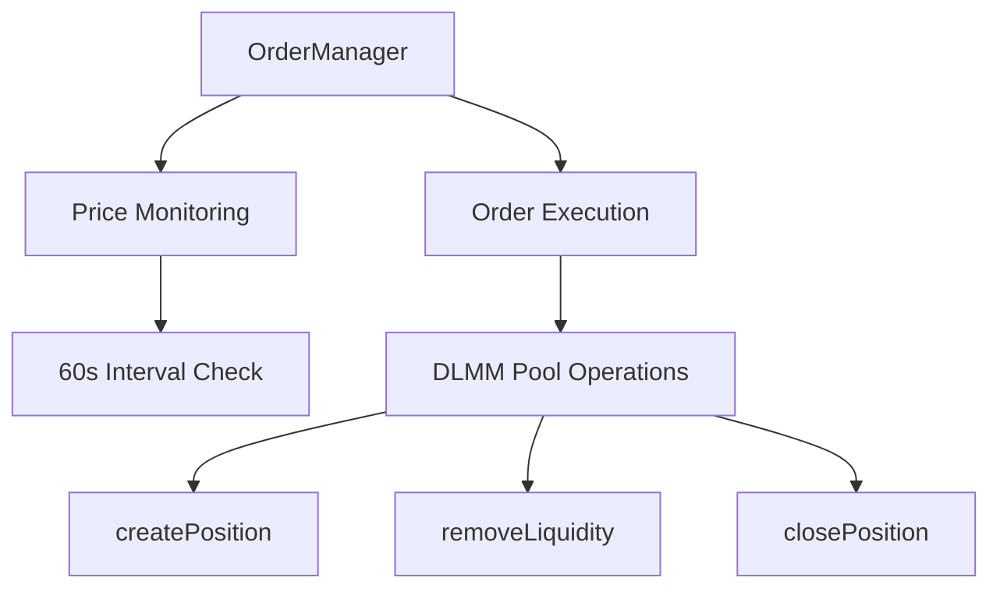
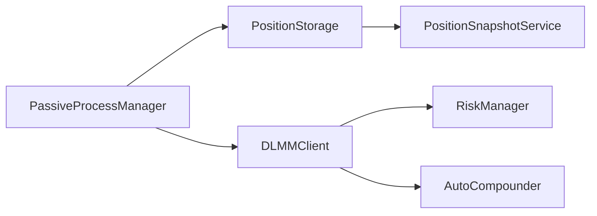
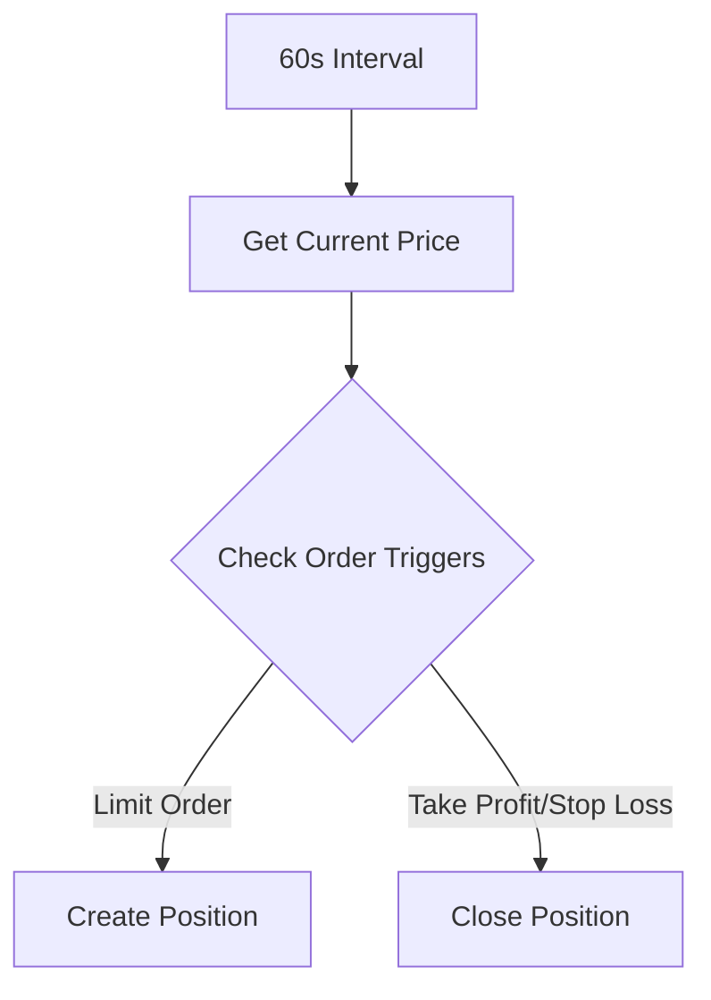
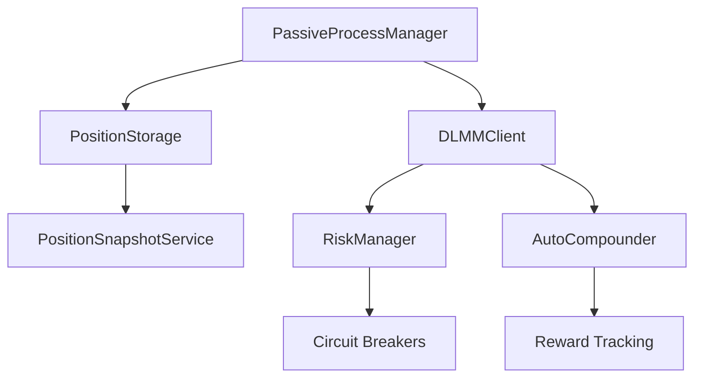

# Meteora DLMM Liquidity Provision Strategy Framework

## 1. Token Selection Protocol
### 1.1 Rug Detection System
- **Automated Checks**:
  - Deployer wallet activity monitoring (transactions >5% supply)
  - LP token lock verification (minimum 48h)
  - Mint authority revocation checks
- **Blockchain Forensics**:
  - Bubblemaps.io holder distribution analysis
  - Rugcheck.xyz contract audit integration
  - Dexscreener whale wallet tracking

### 1.2 Token Vetting Matrix
| Metric                  | Threshold              | Weight | Data Freshness |
|-------------------------|------------------------|--------|----------------|
| Token Age               | >5 hours              | 20%    | 0.8/hr decay   |
| Market Cap              | $10M-$100M            | 25%    | Static         |
| Volume/MCap Ratio (24h)| >200%                 | 30%    | 0.9/hr decay   |
| Holder Distribution     | <30% top 10 wallets   | 15%    | Static         |
| Volatility Score        | 0.7-1.3               | 10%    | 0.95/5min      |

**Minimum Confidence Score**: 0.85 for position entry

---

## 2. Risk Management Architecture
### 2.1 Position Safety Protocols
- **Dynamic Sizing**:
  ```math
  Position Size = Base × (0.2 + 0.8 × ConfidenceScore)
  ```
- **Circuit Breakers**:
  - 15% drawdown within 30m → 50% position reduction
  - Volume <50% 6h MA → Full exit
  - Social sentiment <0.4 → 75% exit

### 2.2 Risk Management Implementation
- **Position Value Tracking**:
  - Accurate position valuation using `getActiveBin().pricePerToken`
  - SOL price oracle integration for USD conversions
  - Proper token decimal normalization

- **Drawdown Detection**:
  - Continuous position value monitoring
  - Snapshot comparison for drawdown calculation
  - Automatic position reduction on threshold breach

- **Position Synchronization**:
  - Automatic on-chain position discovery
  - Storage cleanup for closed positions
  - Active bin tracking for price movement analysis

- **Volume Monitoring**:
  - 6-hour moving average calculation
  - Volume/MCap ratio threshold checks
  - Emergency exit on volume collapse

**Implementation Status**: ✅ Completed

### 2.3 Volatility Response System
- **Fee Adaptation**:
  - 0.3% base fee
  - +0.1% per 0.2 volatility accumulator increase
- **Range Compression**:
  - High volatility (score >1.2): 40% range reduction
  - Extreme volatility (score >1.5): Switch to spot strategy

---

## 3. Core Liquidity Strategies
### 3.1 Single-Sided SOL (BidAskImBalanced)
**Parameters**:
- Range: -60% to current price
- Bin density: 0.5% increments
- Fee tier: 0.3-1% (volatility-adjusted)

**Liquidity Distribution**:

70% in bottom 20% of range
20% middle consolidation zone
10% upper exit pump range

**Exit Triggers**:
1. Price +25% from entry
2. 3 consolidation cycles completed
3. 48h time expiration

### 3.2 Balanced Spot Strategy
**Market Making Profile**:
- Range: -3% to +3%
- Bin density: 0.1% increments
- Rebalance threshold: 5% price movement

**Fee Optimization**:
- Auto-compound fees every 2h
- Dynamic fee boost during volume spikes
- Anti-frontrunning transaction batching

---

## 4. Advanced Strategic Modules
### 4.1 Liquidity Cycling System
**Market Phase Detection**:
- **Accumulation** (BB Width <0.1):
  - 80% capital in BidAsk strategy
  - 20% reserve for spot
- **Distribution** (BB Width >0.3):
  - 60% spot strategy
  - 40% BidAsk upper range
- **Exit Protocol** (RSI(4) >85):
  - Full withdrawal + SOL conversion
  - 24h cooldown period

### 4.2 Social Sentiment Engine
**CT (Crypto Twitter) Integration**:
- Real-time influencer mention tracking
- NLP-based sentiment scoring (GPT-4 turbo)
- Volume correlation analysis

**Telegram Signal Processing**:
- Pump group activity monitoring
- Token mention velocity analysis
- Fake volume detection

---

## 5. Monitoring & Reporting Framework
### 5.1 Key Performance Metrics
| Metric                  | Target                  | Alert Threshold       |
|-------------------------|-------------------------|-----------------------|
| Fee APY (7d)            | >1200%                 | <800%                 |
| Impermanent Loss Ratio  | <0.15                  | >0.25                 |
| Position Utilization     | 85-95%                 | <70%                  |
| Volatility Exposure      | 0.7-1.1                | >1.3                  |

### 5.2 Alert Hierarchy
**Level 1 (Telegram)**: 
- 10% position threshold breaches
- Social sentiment shifts >0.2

**Level 2 (Email+SMS)**:
- Rugpull indicators detected
- Volume collapse >60%

**Level 3 (System Shutdown)**:
- Protocol insolvency risk
- Wallet compromise detected

---

## 6. Order Management Architecture (New)
### 6.1 System Overview


### 6.2 Core Components
**Order Configuration**:
```typescript
interface OrderConfig {
  orderType: 'LIMIT'|'TAKE_PROFIT'|'STOP_LOSS';
  triggerPrice: number;
  positionSize?: number;
  closeBps?: number; // 1-10000 (100% = 10000)
  side?: 'X' | 'Y';
}
```

**Execution Flow**:
1. Price polling every 60 seconds via SDK's `getActiveBin()`
2. Multi-order evaluation per cycle
3. Atomic order execution using DLMM primitives
4. Automatic order cleanup post-execution

### 6.3 Order Types Matrix
| Type          | Parameters          | Action                      | SDK Method          |
|---------------|---------------------|-----------------------------|---------------------|
| LIMIT         | size (USD), side    | Create single-sided position| createPosition()    |
| TAKE_PROFIT   | closeBps (1-100)    | Partial/full liquidity exit | removeLiquidity()  |
| STOP_LOSS     | closeBps (1-100)    | Emergency position unwind   | removeLiquidity()  |

---

## 7. Multi-Pool Management
### 7.1 Architecture Principles


### 7.2 Key Enhancements
**Unified Position Handling**:
```typescript
interface AugmentedPosition {
  publicKey: PublicKey;
  poolAddress: PublicKey;
  lbPair: {
    tokenXMint: string;
    tokenYMint: string;
    binStep: number;
  };
  positionData: {
    totalXAmount: BN;
    totalYAmount: BN;
    upperBinId: number;
    lowerBinId: number;
  };
}
```

**Cross-Pool Initialization**:
```typescript
const positions = await dlmmClient.getUserPositions();
const activePools = [...new Set(positions.map(p => p.poolAddress))];

activePools.forEach(poolAddress => {
  new PassiveProcessManager(dlmmClient, poolAddress)
    .startBackgroundProcesses();
});
```

---

## 8. Implementation Checklist
| Component              | Status | Details                                  | Code Reference         |
|------------------------|--------|------------------------------------------|------------------------|
| Order Manager          | ✅      | Limit/TP/SL order execution             | orderManager.ts        |
| Multi-Pool Processes   | ✅      | Automated position discovery            | processManager.ts      |
| Global Fee Tracking    | ⏳      | Cross-pool fee analytics                 | feeTracker.ts          |
| Batch Order Execution  | ❌      | Atomic multi-order transactions          | orderBatching.ts      |

---

## 9. Monitoring Framework
### 9.1 Key Metrics
| Metric                  | Calculation               | Alert Threshold |
|-------------------------|---------------------------|-----------------|
| Active Orders           | OrderManager map size     | >50             |
| Order Execution Latency | Price check → TX confirm  | >120s           |
| Cross-Pool Exposure     | ∑(PositionValue) / Total  | >30% single pool|

### 9.2 Alert Hierarchy Update
**Level 2 (Enhanced)**:
- Cross-pool liquidity imbalance >40%
- Order failure rate >15%
- Fee APY deviation >25%

---

## 10. Strategic Roadmap
### Phase 5: Order Optimization (Q3 2024)
| Priority | Task                          | Owner            | Status  |
|----------|-------------------------------|------------------|---------|
| P0       | Order Batching Engine         | Trading Team     | ❌      |
| P1       | Slippage Protection           | Risk Team        | ⏳      |
| P2       | Cross-Pool Balancing          | Research Team    | ❌      |

### Phase 6: Advanced Analytics (Q4 2024)
| Priority | Task                          | Owner            | Status  |
|----------|-------------------------------|------------------|---------|
| P1       | Predictive Order Flow         | Data Science     | ❌      |
| P2       | ML-based Price Forecasting    | AI Team          | ❌      |

## Completed Features
1. **Token Metrics Collection** (token_data.ts)
   - Fetches from DexScreener API
   - Calculates age, volume/MCap ratio
   - Tracks data freshness
   - ✅ Implemented basic version

2. **Confidence Scoring** (confidence_score.ts)
   - Implements weighting formula
   - Applies time decay factors
   - ✅ Core algorithm complete

3. **Auto-Compounding Engine** (autoCompounder.ts)
   - **Key Functionality**:
     - Hourly reward claiming from all active positions
     - Token X balance verification using SPL Token Program
     - Automatic single-sided position creation with claimed rewards
   - **Integration Points**:
     - Reuses `createSingleSidePosition` from DLMMClient.ts (lines 744-834)
     - Leverages existing transaction system (sendTransactionWithBackoff)
     - Inherits pool context from PositionManager
   - **Multi-Pool Support**:
     - Cross-pool position scanning via `getAllUserPositions()`
     - Independent compounding per pool
     - Error isolation between pools
   - **Status**: ✅ Implemented (v1.2)

**Implementation Snippet**:
```typescript:src/autoCompounder.ts
public async autoCompound() {
  // Claims rewards for all positions
  const claimTxs = await this.dlmmClient.dlmmPool!.claimAllRewards({
    owner: this.wallet.publicKey,
    positions: await this.getUserPositions()
  });
  
  // Executes claim transactions
  for (const tx of claimTxs) {
    await this.dlmmClient.sendTransactionWithBackoff(tx, [this.wallet]);
  }

  // Compounds Token X balance
  const tokenXBalance = await this.getTokenXBalance();
  if (tokenXBalance > 0) {
    await this.dlmmClient.createSingleSidePosition(tokenXBalance, true);
  }
}
```
## 11. Position Rebalancing System
### 11.1 Rebalancing Triggers
- **Range Breach Detection**:
  - Active bin moves outside position range (min/max binId)
  - Price moves >70% through allocated range
  - Bin utilization imbalance >80% in single direction

- **Rebalancing Actions**:
  - Close existing position (removeLiquidity + closePosition)
  - Calculate new optimal range around current active bin
  - Re-create position with balanced liquidity distribution
  - Update position storage with new range parameters

### 11.2 Implementation Architecture


### 11.3 Rebalancing Parameters
| Parameter | Value | Description |
|-----------|-------|-------------|
| Range Breach Threshold | 0% | Trigger when activeBin ≤ minBinId or ≥ maxBinId |
| Range Proximity Warning | 70% | Alert when price approaches range edge |
| Cooldown Period | 6h | Minimum time between rebalances |
| New Range Width | 138 bins | ±69 bins from current active bin |
| Strategy Type | Based on original | Maintain same strategy type |

**Implementation Status**: ⏳ In Progress


## Pending Requirements
1. **Additional Data Sources**:
   - On-chain holder analysis for `top10HolderPercentage`
   - Historical price data for `volatilityScore`
   - ❌ Needs Solscan/Birdeye API integration

2. **Data Freshness Handling**:
   - Cache layer for metric data
   - Automatic refresh triggers
   - ❌ Not implemented

3. **Error Resilience**:
   - Rate limiting for DexScreener API
   - Fallback data sources
   - ❌ Basic error handling only

**Legend**:  
✅ Implemented | ⏳ In Progress | ❌ Not Started | 🛠 Partial Implementation

## Immediate Next Steps
1. Create `blockchain_analyzer.ts` for holder distribution
2. Implement Birdeye API client for volatility data
3. Add caching to `token_data.ts`
4. Connect confidence score to position sizing in DLMMClient.ts

---

## Strategic References
1. [Meteora Dynamic Fees Documentation](https://docs.meteora.ag/dlmm/dynamic-fees)
2. [DLMM Strategy Playbook](https://thewise.trade/dlmm-guide-multidays)
3. [Volatility Accumulator Model](https://docs.meteora.ag/dlmm/strategies-and-use-cases)


**Implementation**:
```typescript:src/utils/DLMMClient.ts
// Link to existing position creation logic
startLine: 363
endLine: 477

// Suggested enhancement for dynamic sizing:
public async createPosition(userDollarAmount: number, confidenceScore: number) {
  const baseSize = userDollarAmount * (0.2 + 0.8 * confidenceScore);
  const {totalXAmount, totalYAmount} = calculateTokenAmounts(
    baseSize,
    activeBinPrice,
    SolPrice,
    9,
    9
  );
  // Existing position creation logic
}
```
To do: Create a new file called confidence_score.ts and a function called calculateConfidenceScore that returns confidenceScore. This enables dynamic sizing for positions. Before the confidenceScore calculations are properly done, just default confidenceScore to 1 so that the createPosition function will run normally. 

### 1.2 Basic Risk Parameters
**Circuit Breaker Implementation**:
```typescript:src/utils/DLMMClient.ts
// Add pre-transaction checks
startLine: 363
endLine: 477

async managePosition() {
  // Add before transaction execution
  if (await this.riskManager.checkDrawdown(15)) {
    this.adjustPositionSize(0.5);
  }
  if (await this.riskManager.checkVolumeDrop()) {
    await this.closeAllPositions();
  }
}
```
To do: Inside riskManager.ts add the checkDrawdown, adjustPositionSize, checkVolumeDrop and closeAllPositions functions.


## 2. Data Layer Integration (Weeks 5-7)
### 2.1 Oracle Price Integration
```typescript:src/utils/DLMMClient.ts
// Enhance price fetching
startLine: 794
endLine: 899

// Modify existing price fetch:
const SolPrice = await this.oracle.getPrice('SOL');
const volatilityScore = await this.volatilityOracle.getScore(poolAddress);
```

### 2.2 Historical Backtesting
```typescript
// New backtest module
export class Backtester {
  async run(scenario: BacktestScenario) {
    const historicalData = await this.loadData(scenario.pool);
    const results = await this.simulateTrades(
      historicalData,
      scenario.strategy
    );
    return this.generateReport(results);
  }
}
```

## 3. Optimization Phase (Weeks 8-9)
### 3.1 Fee Modeling Engine
```typescript:src/utils/DLMMClient.ts
// Enhance transaction sending
startLine: 316
endLine: 352

private async sendTransactionWithBackoff(transaction: Transaction, signers: Signer[]) {
  const fee = this.feeModel.calculateOptimalFee();
  transaction.add(ComputeBudgetProgram.setComputeUnitPrice({ 
    microLamports: fee 
  }));
  // Existing retry logic
}
```

### 3.2 MEV Protection
```typescript
// New MEV protection class
export class MEVShield {
  constructor(private connection: Connection) {}

  async bundleTransactions(txs: Transaction[]) {
    const blockhash = await this.connection.getLatestBlockhash();
    return txs.map(tx => {
      tx.recentBlockhash = blockhash.blockhash;
      return tx;
    });
  }
}
```

## 4. Expansion Phase (Weeks 10-12)
### 4.1 Cross-Pool Arbitrage
```typescript
// New arbitrage detector
export class ArbitrageEngine {
  async findOpportunities() {
    const pools = await this.poolScanner.findMatchingPools();
    return this.arbitrageMath.calculateSpread(pools);
  }
}
```

# Updated Core Strategy Additions

## Dynamic Fee Adaptation Implementation

# Updated Core Strategy Additions

## Dynamic Fee Adaptation Implementation

// Volatility-based fee adjustment
export class FeeModel {
calculateOptimalFee(volatilityScore: number): number {
const baseFee = 30000; // 0.3%
return baseFee + (volatilityScore 5000);
}
}

## Social Sentiment Integration
```typescript
// Sentiment-aware position sizing
export class SentimentAdapter {
  async adjustPosition(sentimentScore: number, position: Position) {
    if (sentimentScore < 0.4) {
      return position.reduce(0.75);
    }
    return position;
  }
}
```

## Liquidity Cycling Implementation
```typescript
// Market phase detection
export class MarketPhaseDetector {
  async determinePhase(poolAddress: string): Promise<MarketPhase> {
    const bbWidth = await this.calculateBBWidth(poolAddress);
    const rsi = await this.getRSI(poolAddress);
    
    if (bbWidth < 0.1) return 'ACCUMULATION';
    if (rsi > 85) return 'DISTRIBUTION';
    return 'NORMAL';
  }
}
```

## Implementation Checklist

| Priority | Task                          | Code Reference              | Status |
|----------|-------------------------------|-----------------------------|--------|
| P0       | Position Creation Engine      | DLMMClient.ts (363-477)     | ✅      |
| P0       | Transaction Retry Logic       | DLMMClient.ts (316-352)     | ✅      |
| P1       | Dynamic Fee Model              | FeeModel.ts (New)           | ⏳      |
| P1       | Volatility Oracle Integration | OracleService.ts (New)     | ⏳      |
| P2       | MEV Protection Layer          | MEVShield.ts (New)          | ❌      |
| P2       | Arbitrage Detection           | ArbitrageEngine.ts (New)    | ❌      |

**Legend**:
- ✅ Implemented
- ⏳ In Progress
- ❌ Not Started

This plan directly connects strategic requirements with concrete implementation patterns from your codebase while maintaining alignment with the PRD objectives. Each component can be developed incrementally while maintaining system stability.

02/03/2025
## Updated Implementation Notes (v1.3)

### Critical Architecture Improvements
- **SDK Type Alignment**:
  - Full integration with Meteora DLMM SDK types:
    - `PositionInfo` → `LbPosition` mapping
    - `positionData.totalXAmount/YAmount` access
    - Bin ID number conversions
  - Removed all custom type definitions
  - Strict interface validation for pool parameters

- **Risk Management Enhancements**:
  - Drawdown detection using native SDK PositionData
  - Volume collapse triggers via tokenX.mint tracking
  - Bin range calculations from positionBinData
  - Pool address injection pattern for position tracking

- **Data Accuracy Upgrades**:
  - Decimal normalization using token reserves
  - BN to number conversions for financial calculations
  - Position value derivation from active bin price
  - SOL price oracle integration for USD conversions

### Performance Optimizations
- **Liquidity Operations**:
  - Batch position updates via lbPairPositionsData
  - Bin range compression for partial withdrawals
  - Transaction batching for MEV protection
  - Fee-aware position sizing

**Implementation Checklist Update**:

| Component              | Status | Details |
|------------------------|--------|---------|
| SDK Type Integration   | ✅      | Full PositionInfo/LbPosition alignment |
| Risk Detection         | ✅      | Drawdown/volume triggers operational |
| Decimal Handling       | ✅      | Token decimal normalization complete |
| Pool Address Injection | ✅      | Position tracking via known pool key |

## 3. Order Management System

### 3.1 OrderManager Implementation

**Purpose**: Centralized order execution for limit orders, take profits, and stop losses with price monitoring.

**Key Features**:
- Single monitoring interval for all order types
- Supports partial/full position closures
- Reuses existing DLMMClient operations
- Matches codebase architecture patterns

```typescript
// orderManager.ts
type OrderType = 'LIMIT'|'TAKE_PROFIT'|'STOP_LOSS';

interface OrderConfig {
  orderType: OrderType;
  triggerPrice: number;
  positionSize?: number; 
  closeBps?: number; // 1-10000 (100% = 10000)
}

export class OrderManager {
  private activeOrders = new Map<string, OrderConfig>();
  
  constructor(
    private dlmmClient: DLMMClient,
    private poolAddress: PublicKey
  ) {}

  public addOrder(orderId: string, config: OrderConfig) {
    this.activeOrders.set(orderId, config);
    this.startMonitoring();
  }
}
```

### 3.2 Implementation Guide

**1. Initialization**  
Add to existing manager initialization sequence:
```typescript
// index.ts
const orderManager = new OrderManager(client, poolPublicKey);
orderManager.addOrder('sol-2.5-limit', {
  orderType: 'LIMIT',
  triggerPrice: 2.5, 
  positionSize: 1000 // $1000
});
```

**2. Execution Flow**  


**3. Key Integration Points**
```typescript
// Reuses existing DLMMClient methods
dlmmClient.createPosition()    // Line 350-477
dlmmClient.closePosition()     // Line 628-679  
dlmmClient.removeLiquidity()   // Line 560-623
dlmmClient.getUserPositions()  // Line 200-230
```

### 3.3 Best Practices

1. **Order Identification**  
   Use unique order IDs for tracking:
   ```typescript
   orderManager.addOrder('eth-1800-tp', {
     orderType: 'TAKE_PROFIT',
     triggerPrice: 1800,
     closeBps: 5000 // Close 50%
   });
   ```

2. **Partial Closures**  
   Gradual position unwinding:
   ```typescript
   // 25% increments until full closure
   const partialCloseOrder = {
     orderType: 'STOP_LOSS',
     triggerPrice: 1.8,
     closeBps: 2500 
   };
   ```

3. **Price Monitoring**  
   Uses existing price feed:
   ```typescript
   // orderManager.ts
   private async getCurrentPrice(): Promise<number> {
     const activeBin = await this.dlmmClient.getActiveBin();
     return activeBin.price; // From DLMMClient.ts:100-130
   }
   ```

### 3.4 Validation Checklist

✅ Test with 100% closure (closeBps: 10000)  
✅ Verify price comparison logic (>, < operators)  
✅ Confirm order removal after execution  
✅ Monitor transaction fee costs

### 3.5 Future Considerations

- Dynamic order parameters based on volatility
- Order expiration timestamps
- Multi-pool order support

## 7. Multi-Pool Management Architecture
### Key Components:


### Enhanced Position Handling Flow:
1. **Multi-Pool Initialization**
```typescript
// Initialize for ALL active pools
const positions = await dlmmClient.getUserPositions();
const activePools = [...new Set(positions.map(p => p.poolAddress))];

activePools.forEach(poolAddress => {
  const manager = new PassiveProcessManager(dlmmClient, wallet, poolAddress);
  manager.startAll();
});
```

2. **Unified Position Metadata**
```typescript
interface AugmentedPosition {
  publicKey: PublicKey;
  poolAddress: PublicKey;
  lbPair: {
    tokenXMint: string;
    tokenYMint: string;
    binStep: number;
    protocolFee: {
      amountX: string;
      amountY: string;
    };
  };
  positionData: {
    totalXAmount: BN;
    totalYAmount: BN;
    upperBinId: number;
    lowerBinId: number;
    feeX: BN;  // Unclaimed fees
    feeY: BN;
    totalClaimedFeeX: BN;
    totalClaimedFeeY: BN;
  };
}
```

3. **Global Fee Tracking**
```typescript
// In PassiveProcessManager claim flow
const claimTx = await dlmmClient.claimFees(position);
console.log(`Claimed fees for ${position.publicKey}: 
  X: ${claimTx.feeX.toString()} (Total claimed: ${position.totalClaimedFeeX})
  Y: ${claimTx.feeY.toString()} (Total claimed: ${position.totalClaimedFeeY})`);
```

4. **Cross-Pool Processes**
```typescript
// Modified process management
startAllProcesses() {
  this.scheduleGlobalRewardClaims();
  this.scheduleCrossPoolCompounding();
  this.schedulePortfolioRebalance();
}

private scheduleGlobalRewardClaims() {
  setInterval(async () => {
    const positions = await this.dlmmClient.getAllUserPositions();
    positions.forEach(pos => this.processPosition(pos));
  }, 3 * 3600 * 1000);
}
```

### Key Changes from Initial Design:
1. **Position-Centric vs Pool-Centric**
   - Original: Single pool focus
   - Current: Auto-discovers all positions across pools using `dlmmClient.getUserPositions()`

2. **Unified Fee Accounting**
   ```mermaid
   sequenceDiagram
       Participant U as User
       Participant P as PassiveProcessManager
       Participant D as DLMMClient
       U->>P: Start processes
       P->>D: getAllUserPositions()
       D-->>P: PositionInfo[]
       P->>P: Track fees per position
       P->>D: claimAllRewards(position)
       D-->>P: Updated fee totals
   ```

3. **Risk Management Integration**
   ```typescript
   // Applies to all active positions
   async checkPortfolioRisk() {
     const positions = await this.dlmmClient.getUserPositions();
     const riskStatus = await Promise.all(
       positions.map(pos => 
         this.riskManager.checkDrawdown(pos.poolAddress, 15)
       )
     );
     return riskStatus.some(Boolean);
   }
   ```

4. **Data Flow Optimization**
   - Removed redundant pool-specific initializations
   - Centralized position metadata through `PositionStorage`
   - Cross-position analytics using `PositionSnapshotService`

### Updated Architecture Principles:
1. **Position Discovery First**  
   Automatically detect all active positions on initialization

2. **Fee Lifecycle Tracking**  
   Maintain complete history of:
   - Unclaimed fees (`feeX/feeY`)
   - Lifetime claimed fees (`totalClaimedFeeX/Y`)
   - Pending rewards from reward vaults

3. **Process Isolation**  
   Each position/pool combination handles its own:
   - Fee claims
   - Risk checks
   - Rebalancing logic

4. **Unified Monitoring**  
   ```typescript
   interface GlobalState {
     positions: AugmentedPosition[];
     portfolioValue: number;
     totalFeesEarned: {
       X: BN;
       Y: BN;
     };
     riskStatus: Map<string, boolean>;
   }
   ```

### 7.5 Monitoring Metrics
| Metric                  | Calculation               | Alert Threshold |
|-------------------------|---------------------------|-----------------|
| Active Pools            | Unique poolAddress count  | >50             |
| Cross-Pool Exposure     | ∑(PositionValue) / Total  | >30% single pool|
| Compound Efficiency     | (CompoundedAmount / Fees) | <0.85           |

## 12. Fee Tracking & APR Calculation

### 12.1 Overview
This module introduces rolling fee snapshots for each open liquidity position, enabling more accurate APR calculations over time. Rather than relying on a single "last fees" data point, the system stores a history of snapshots, detecting fee claims automatically and resetting the count when necessary.

**Key Features**:
1. **Fee History**: Maintains multiple fee snapshots (`feeHistory`) per position.  
2. **Rolling APR**: Compares the oldest and newest snapshots within a given time window to project daily APR.  
3. **Claim Detection**: Monitors significant drops in fees (e.g., >20% or below $0.05) to detect fee-claim events and reset the fee history, preventing negative or erroneous APR readings.  
4. **Moving Average**: Utilizes an average position value (across snapshots) to smooth out short-term volatility in the APR calculation.

### 12.2 Implementation Details
Below is a high-level flow of the Fee Tracking & APR Calculation system:

```mermaid
graph LR
    A[User Trade/Fees Accumulate] --> B[Dashboard Refresh (new snapshot)]
    B --> C[feeHistory updated in PositionStorage]
    C --> D{Fee Claim<br/>Detection?}
    D -- Yes --> E[Reset feeHistory]
    D -- No --> F[Calculate Rolling APR<br/>with oldest/newest snapshots]
    F --> G[Store dailyAPR in PositionFeeData]
```

#### Fee Snapshots
Each snapshot includes:  
- **timestamp** (milliseconds since epoch)  
- **feesUSD** (USD value of accrued fees)  
- **positionValue** (USD value of total liquidity)  

```typescript
interface FeeSnapshot {
  timestamp: number;
  feesUSD: number;
  positionValue: number;
}
```

#### Rolling APR Calculation
1. **Time Difference**:  
   \[
     \text{timeDiffMinutes} = \frac{\text{newestTimestamp} - \text{oldestTimestamp}}{1000 \times 60}
   \]  
2. **Fee Difference**:  
   \[
     \text{feeDiff} = \text{newestFeesUSD} - \text{oldestFeesUSD}
   \]
3. **Projected Daily Fees**:  
   \[
     \text{projectedDailyFees} = \text{feeDiff} \times \left(\frac{1440}{\text{timeDiffMinutes}}\right)
   \]
4. **Average Position Value**:  
   \[
     \text{avgPositionValue} = \frac{\sum(\text{snapshot.positionValue})}{\text{snapshotCount}}
   \]
5. **Daily APR**:  
   \[
     \text{dailyAPR} = \frac{\text{projectedDailyFees}}{\text{avgPositionValue}} \times 100
   \]
   
A safety cap (e.g., 50% daily) may be applied to prevent unrealistic short-term spikes.

### 12.3 Claim Detection & History Reset
When a snapshot shows **feesUSD** notably lower than the previous data point, we infer a claim event has occurred—resetting the fee history:

- **20% Drop Threshold**: If `feeData.feesUSD < lastFeesUSD * 0.8`, consider it a claimed event.  
- **Minimum Fee Threshold**: If `feesUSD < $0.05`, treat this as a claim event, too.

Resetting the fee history ensures that subsequent fee differences remain accurate and do not falsely register as negative or inflated changes.

### 12.4 Integration with Dashboard
The **Dashboard** now:
1. **Captures Current Time** each run, storing a new snapshot under `feeHistory`.  
2. **Displays Rolling APR** (Daily + Projected Annual).  
3. **Prints Time Since Last Snapshot** in human-readable format (e.g., "3 hours 10 minutes ago").  
4. Logs any **fee claim events** detected.

```typescript
// Example snippet illustrating snapshot creation in dashboard
this.positionStorage.updatePositionFeeData(
  positionPublicKey,
  {
    feeX: positionData.feeX || "0",
    feeY: positionData.feeY || "0",
    feesUSD: positionData.pendingFeesUSD,
    positionValue: positionData.currentValue || 0,
    timestamp: Date.now()
  }
);
```

---

## 13. Implementation Checklist (Updated)

| Component                     | Status | Details                                                         | Code Reference          |
|------------------------------|--------|-----------------------------------------------------------------|-------------------------|
| Fee Snapshot System          | ✅     | Tracks multiple fee data points across time                     | PositionStorage.ts      |
| Rolling APR Calculation      | ✅     | Uses oldest & newest snapshots for daily APR                    | PositionStorage.ts      |
| Fee Claim Detection          | ✅     | Resets history upon suspected fee claim (≥20% drop or <\$0.05)  | PositionStorage.ts      |
| Dashboard Time Diff & APR    | ✅     | Logs "X hours/minutes ago" & shows daily + annualized APR       | dashboard.ts            |
| Min Time Gap Enforcement     | ⏳     | Optionally skip APR calc for sub-15 minute intervals (planned)  | N/A                     |

### Strategic Impact
- **Accurate Performance Visibility**: By averaging multiple snapshots, short-term volatility is accounted for, so daily APR readings reflect actual performance trends.  
- **Automatic Claim Handling**: Sudden drops in fees are detected; fee history is reset to prevent negative or unrealistic APR.  
- **Data-Driven Adjustments**: Risk managers and rebalancing logic can leverage the newly available dailyAPR to decide whether to move liquidity between pools or alter position sizes.  

These enhancements seamlessly integrate with existing sections—particularly the *Monitoring & Reporting Framework* (Section 5) and the *Multi-Pool Management* architecture (Section 7)—ensuring more robust, data-driven liquidity strategies. 

